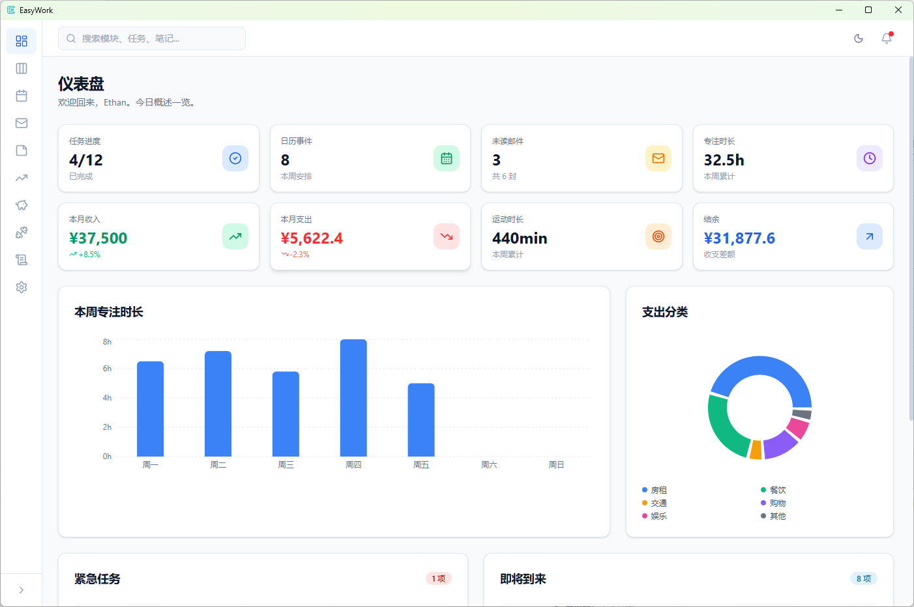

# EasyWork

> **Simplify your work: 集邮箱、看板、笔记、记账于一体的一站式效率工具**

[English Version](./README.md) | [设计文档](./docs/EasyWork%E8%AE%BE%E8%AE%A1%E6%96%87%E6%A1%A3.md)

EasyWork 是一款基于 **Tauri + React + Rust** 技术栈开发的跨平台个人效率工具，适配 **Windows** 与 **Android** 双平台。整合了任务管理、日程规划、邮件处理、笔记记录、股票盯盘、记账管理和运动追踪等核心功能，致力于打造一站式个人工作与生活管理中心。

<div align="center">
  
  <p><em>EasyWork Dashboard — 你的工作生活指挥中心</em></p>
</div>

---

## ✨ 功能模块

### 📊 Dashboard（数据总览）

应用的首页与数据中枢，聚合展示各模块核心数据：

| 统计卡片 | 数据来源 | 展示内容 |
|---------|---------|---------|
| 今日待办 | 看板模块 | 待办任务数量 + 紧急任务标记 |
| 今日日程 | 日历模块 | 今日日程数量 + 下一项日程倒计时 |
| 消费金额 | 记账模块 | 昨日支出 / 本月预算使用率 |
| 运动步数 | 运动模块 | 近 30 天运动情况 / 目标完成率 |

- 自选股涨跌幅列表（红涨绿跌）+ 迷你走势图
- 快捷入口：快速添加任务、记录笔记、快速记账、运动记录

### 📋 看板（任务管理）

完整的任务生命周期管理，5 列泳道：

```
📋 未开始 → 🔄 进行中 → ✅ 已完成 → 📦 归档
                       → ❌ 已放弃
```

**任务卡片字段：** 标题、负责人、开始/结束时间、运行时长、完成评分（1–5★）、重要程度（高/中/低）、紧急程度（艾森豪威尔矩阵）、难易程度、时间轴、附件。

**定期复盘：** 每周/每月自动生成复盘报告，统计完成率、平均时长、评分分布，提供改进建议。

### 📅 日历（日程规划）

多维度时间视图，集成展示各类日程与事件：

- **日视图：** 24 小时时间轴
- **周视图：** 7 天并列
- **月视图：** 整月概览，叠加显示任务截止、消费记录、运动情况
- 支持农历显示与中国法定节假日标注
- 支持钉钉日程订阅

### ✉️ 邮箱（邮件处理）

参照 Pebble 设计理念，简洁高效的邮件管理体验。

- IMAP/SMTP 协议收发
- 多账号管理与统一收件箱
- 自动识别邮箱服务商并填充 IMAP/SMTP 配置
- 联系人管理（增删改查 + VCF 导入导出 + 分组）
- 自定义邮件签名
- 文件夹：收件箱、已发送、草稿箱、垃圾箱（保留 30 天）

### 📝 笔记（知识管理）

基于 Tiptap 的富文本编辑与知识管理。

- 兼容 Markdown 语法，支持实时预览
- 文件夹/标签双维度分类
- 全文搜索（标题 + 内容）
- 图片粘贴/上传
- 附件关联支持
- 历史版本回溯
- 导出为 PDF / Markdown / HTML
- 专注模式，隐藏干扰元素

### 📈 股票（行情盯盘）

实时行情盯盘与投资管理。

- 实时价格、涨跌幅、成交量
- 自选股管理 + 涨跌幅提醒
- K 线图（日 K / 周 K / 月 K）
- 技术指标：MA、MACD、KDJ、RSI
- 关联个股新闻
- 数据来源：新浪财经、腾讯财经（免费 API），支持自定义数据源

### 💰 记账（财务管理）

个人财务管理，轻松掌握收支状况。

- 快速记录每笔收入与支出
- 预设分类（餐饮、交通、购物、娱乐等）+ 自定义分类
- 预算管理 + 超支预警
- 统计图表：趋势图、分类饼图、月度对比
- 账单导入：支持支付宝/微信 CSV 导入
- 导出为 Excel / CSV
- 日/周/月/年/分类多维度统计

### 🏃 运动（运动追踪）

基础运动数据追踪与第三方平台同步。

- 手动记录：运动类型、时长、距离、消耗卡路里
- 支持运动类型：跑步、骑行、健身、球类运动
- 每日/每周运动目标设定
- 历史趋势分析
- 对接华为运动健康 API 与 Keep 运动数据接口（需授权）

### 📜 日志（调试）

开发与排障专用模块。

- 日志级别：DEBUG / INFO / WARN / ERROR
- 实时追加显示，支持按级别、模块、时间范围筛选
- 自动清理超过 30 天的旧日志
- 导出为文本文件

### ⚙️ 设置（系统配置）

系统级配置管理面板。

| 分类 | 配置项 |
|------|--------|
| 通用 | 语言选项、主题（浅色/深色/跟随系统）、启动行为 |
| 账号 | 邮箱账号、运动平台账号、股票数据源 |
| 通知 | 邮件通知、任务提醒、股票预警 |
| 数据 | 备份/恢复、导出、存储位置 |
| 关于 | 版本信息、更新检查、开源许可 |

---

## 🛠️ 技术架构

| 层级 | 技术 | 用途 |
|------|------|------|
| 桌面壳 | Tauri 2.x | 跨平台桌面/移动端运行时 |
| 前端框架 | React 19 | UI 渲染 |
| 构建工具 | Vite 8.x | 开发服务器与构建 |
| 路由 | TanStack Router | 类型安全路由 |
| 状态管理 | Zustand 5 | 轻量状态管理 |
| UI 组件 | shadcn/ui + Tailwind CSS 4 | 现代 UI 原语 |
| 数据存储 | SQLite (rusqlite) | 本地持久化 |
| 后端语言 | Rust | 系统逻辑与 IPC |
| 包管理 | pnpm | Monorepo 工作区 |
| 类型安全 | TypeScript ~6.0 | 类型系统 |

### 架构图

```
┌─────────────────────────────────────────────────────┐
│                   EasyWork 应用                        │
│                                                      │
│  ┌──────────────┐     IPC (invoke)   ┌────────────┐  │
│  │  React 前端    │ ◄──────────────► │ Rust 后端   │  │
│  │  (10 个模块)   │                  │ (Commands)  │  │
│  │               │                  │            │  │
│  │  ┌─────────┐  │                  │ ┌────────┐ │  │
│  │  │Dashboard│  │                  │ │ SQLite │ │  │
│  │  │ 看板     │  │                  │ │   DB   │ │  │
│  │  │ 日历     │  │                  │ └────────┘ │  │
│  │  │ 邮箱     │  │                  │ ┌────────┐ │  │
│  │  │ 笔记     │  │                  │ │ HTTP   │ │  │
│  │  │ 股票     │  │                  │ │ Client │ │  │
│  │  │ 记账     │  │                  │ └────────┘ │  │
│  │  │ 运动     │  │                  │            │  │
│  │  │ 日志     │  │                  │            │  │
│  │  │ 设置     │  │                  │            │  │
│  │  └─────────┘  │                  └────────────┘  │
│  └──────────────┘                                    │
└─────────────────────────────────────────────────────┘
```

---

## 🚀 快速开始

### 环境要求

- Node.js >= 18
- pnpm >= 9
- Rust 工具链（开发 Tauri 桌面应用需要）

### 安装与运行

```bash
# 克隆仓库
git clone https://github.com/ethanbourne789/EasyWork.git
cd EasyWork

# 安装依赖
pnpm install

# 启动开发服务器
pnpm dev

# 或以 Tauri 桌面应用运行
pnpm tauri dev
```

### 打包构建

```bash
# 构建 Web 版本
pnpm build

# 构建 Tauri 桌面应用
pnpm tauri build
```

---

## 🗺️ 项目结构

```
E:\Dev\EasyWork/
├── apps/                    # 微前端子应用
│   ├── main/                # 主 Shell（布局、导航栏、主题）
│   ├── app-dashboard/       # Dashboard 模块
│   ├── app-kanban/          # 看板任务管理
│   ├── app-calendar/        # 日历模块
│   ├── app-mail/            # 邮箱模块
│   ├── app-notes/           # 笔记模块
│   ├── app-stock/           # 股票模块
│   ├── app-accounting/      # 记账模块
│   ├── app-sports/          # 运动模块
│   ├── app-logs/            # 日志模块
│   └── app-settings/        # 设置模块
├── shared/                  # 共享代码（类型、工具函数、常量）
├── src/                     # 前端源代码（Vite 入口）
├── src-tauri/               # Tauri Rust 后端
│   ├── src/
│   │   ├── commands/        # IPC 命令处理器
│   │   ├── db/              # SQLite 连接与迁移
│   │   └── services/        # 业务逻辑层
│   └── Cargo.toml
├── docs/                    # 设计文档与实施计划
├── package.json             # 根工作区配置
└── pnpm-workspace.yaml
```

---

## 🎨 设计理念

- **现代简约风格**——受 Notion 与 Linear 启发的清爽 UI，大量留白与圆角卡片
- **深色/浅色主题**——三档切换（浅色、深色、跟随系统），统一的色彩体系
  - 主色调：`#5BCFC4` → `#1E5DA8` 渐变
  - 侧边栏：固定 60px 图标模式，深色渐变背景
- **数据驱动的 Dashboard**——各模块数据实时聚合，不重复存储
- **响应式布局**——桌面端（≥1024px）侧边栏布局，平板（768–1023px）可隐藏侧边栏，移动端（<768px）底部 Tab 导航

---

## 📦 模块一览

| # | 模块 | 路由 | 说明 |
|---|------|------|------|
| 1 | Dashboard | `dashboard` | 数据概览与快捷操作 |
| 2 | 看板 | `kanban` | 任务全生命周期管理 |
| 3 | 日历 | `calendar` | 多视图日程与集成展示 |
| 4 | 邮箱 | `mail` | IMAP/SMTP 邮件客户端 |
| 5 | 笔记 | `notes` | 富文本笔记与知识管理 |
| 6 | 股票 | `stock` | 实时行情盯盘 |
| 7 | 记账 | `accounting` | 个人财务管理 |
| 8 | 运动 | `sports` | 运动数据追踪 |
| 9 | 日志 | `logs` | 调试与排障日志 |
| 10 | 设置 | `settings` | 系统配置管理 |

---

## 🔒 隐私与安全

- 敏感数据（邮箱密码等）AES 加密存储
- SQLite 数据库文件权限控制
- 远程图片默认不加载（防追踪）
- DOMPurify 过滤富文本 XSS 风险
- 股票行情数据仅供参考，不构成投资建议

---

## 📄 开源许可

本项目为开源软件，许可信息详见仓库。

---

## 🤝 参与贡献

欢迎提交 Issue 或 Pull Request 参与贡献！

---

<div align="center">

**EasyWork — 简化工作，放大生活。**

[报告问题](https://github.com/ethanbourne789/EasyWork/issues) · [功能建议](https://github.com/ethanbourne789/EasyWork/issues)

</div>
