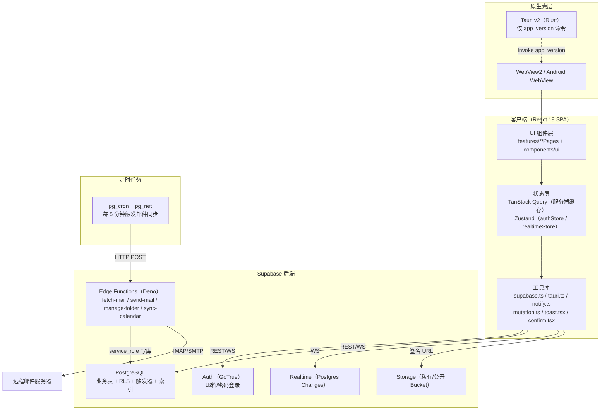
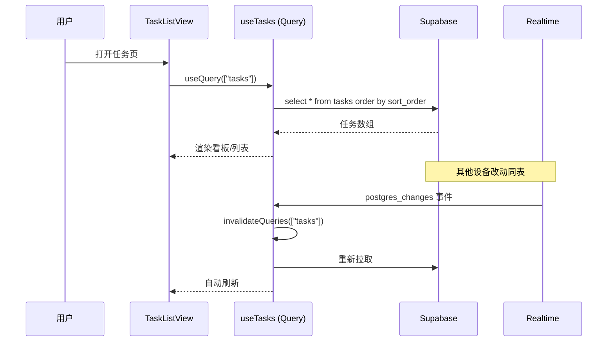
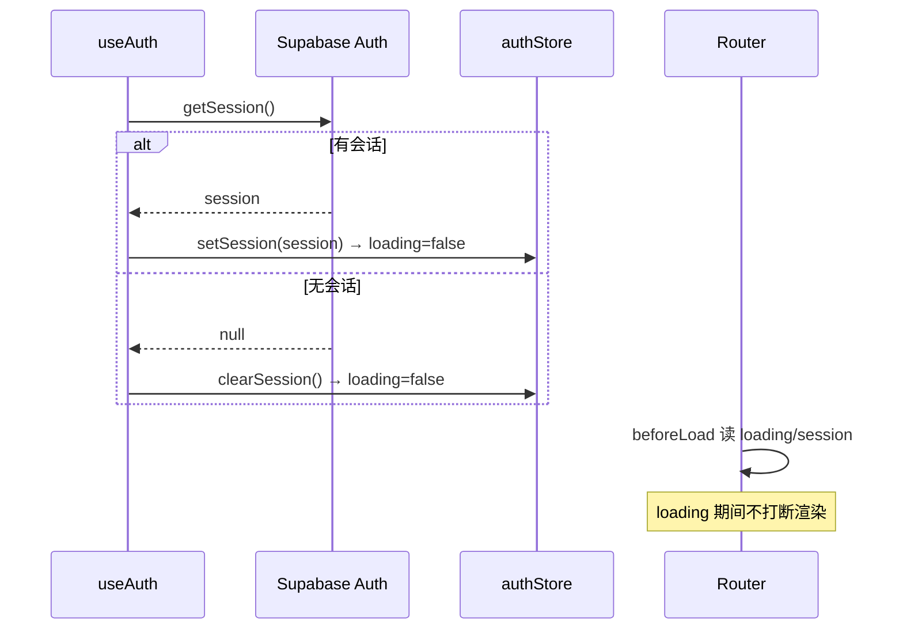
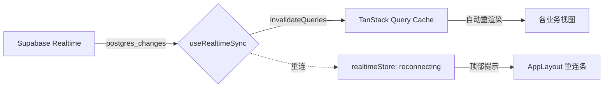
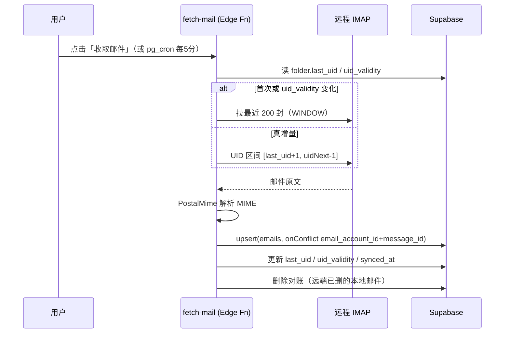
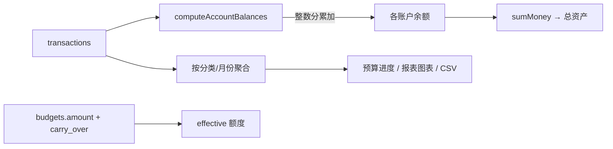

# EasyWork 技术文档（工程手册）

> 版本：2026-08-11 ｜ 项目路径：`E:\Dev\EasyWork0807`
> 适用读者：需要深入理解系统架构、数据模型、实现细节的开发者与维护者。
> 文档性质：本文档客观描述「当前代码实际做了什么、逻辑怎么走」。已知缺陷与技术债统一放在附录，不影响主体阅读。
> 配套资源：本文档同目录的 `assets/` 下含 16 张应用实拍截图（以 `demo@easywork.app` 真实账号登录后截取），以及可由本文件生成的 HTML 版本。

---

## 目录

1. [项目概览](#1-项目概览)
2. [系统架构](#2-系统架构)
3. [技术栈](#3-技术栈)
4. [目录结构与模块边界](#4-目录结构与模块边界)
5. [认证与安全](#5-认证与安全)
6. [应用外壳与导航](#6-应用外壳与导航)
7. [主题系统](#7-主题系统)
8. [实时同步](#8-实时同步)
9. [通知系统](#9-通知系统)
10. [工具库](#10-工具库)
11. [功能模块详解](#11-功能模块详解)
    - 11.1 [仪表盘 Dashboard](#111-仪表盘-dashboard)
    - 11.2 [任务 Tasks](#112-任务-tasks)
    - 11.3 [日历 Calendar](#113-日历-calendar)
    - 11.4 [邮件 Mail](#114-邮件-mail)
    - 11.5 [笔记 Notes](#115-笔记-notes)
    - 11.6 [记账 Finance](#116-记账-finance)
    - 11.7 [设置 Settings](#117-设置-settings)
12. [数据库 Schema（全表字段）](#12-数据库-schema全表字段)
13. [Edge Functions（服务端函数）](#13-edge-functions服务端函数)
14. [构建与发布](#14-构建与发布)
15. [测试](#15-测试)
16. [附录：已知问题与技术债](#16-附录已知问题与技术债)

---

## 1. 项目概览

**EasyWork** 是一个面向个人 / 小团队的**桌面端全能生产力工作台**（Tauri 封装），在同一个应用内整合了任务管理、邮箱、笔记、记账、日历与仪表盘六大模块。后端采用 Supabase（PostgreSQL + Auth + Realtime + Storage + Edge Functions），前端为 React 19 + TypeScript + Vite + Tailwind v4，并支持以纯 Web 方式运行（浏览器）与桌面端（Windows / Android）运行。

核心设计取向：

- **单一数据源**：所有业务数据（任务、邮件、笔记、记账等）均直接读写真实 Supabase，受 RLS（Row Level Security）按 `auth.uid()` 隔离。历史上曾有的「演示账号本地伪造会话 / mockStore」模式已被彻底移除（2026-08-10），演示数据通过 `seed.sql` 写入真实数据库，登录入口走真实 `signInWithPassword`。
- **安静优先 + 一眼扫读**：界面以侧边图标栏 + 内容区为主，强调信息密度与两步可达。
- **实时 + 缓存**：以 TanStack Query 为客户端缓存核心，Supabase Realtime 触发 Query 失效实现「近实时」刷新，不做乐观更新（所有写操作成功后统一 `invalidateQueries`）。

> 截图说明：下文所有「图 N」均指向 `assets/` 下实拍截图，均为已登录真实界面。

---

## 2. 系统架构

### 2.1 分层架构



### 2.2 前端架构要点

- **路由**：TanStack Router（文件式 + 代码生成 `routeTree.gen.ts`）。根路由 `indexRoute` 按会话重定向；受保护路由 `appRoute.beforeLoad` 在「非加载中且未登录」时重定向到 `/login`。
- **数据获取与缓存**：TanStack Query 统一管理异步数据，`queryKey` 按模块分层（如 `["finance","transactions"]`、`["tasks"]`）。写操作统一经 `useSafeMutation` 封装，成功后精确失效对应 key。
- **全局状态**：仅两处用 Zustand —— `authStore`（会话）与 `realtimeStore`（实时连接状态）。业务模块自身不依赖 Zustand，用户身份经 `getCurrentUserId()` 注入 mutation。
- **跨组件通信**：任务→日历跳转等用 `window.dispatchEvent(new CustomEvent("ew:navigate", ...))` 自定义事件；全局搜索用 `ew:search` 事件驱动对话框。

### 2.3 数据流总览（以「任务列表」为例）



---

## 3. 技术栈

| 层 | 技术 | 说明 |
|---|---|---|
| 语言 | TypeScript 5 + React 19 | 严格模式（`strict`、`noUnusedLocals`） |
| 构建 | Vite 5 + `@tailwindcss/vite`（Tailwind v4） | 别名 `@` → `./src` |
| 路由 | TanStack Router | 类型安全、受保护路由守卫 |
| 数据 | TanStack Query v5 | 服务端缓存 + 失效策略 |
| 全局状态 | Zustand | 仅 `authStore` / `realtimeStore` |
| 校验 | Zod + react-hook-form | 表单与 API 入参校验 |
| UI 组件 | shadcn/ui（new-york 风格）+ Radix | `components/ui` 手写，非 npm 托管 |
| 样式 | Tailwind v4（`@theme` CSS 变量） | 品牌色 Iris `oklch(56% 0.17 264)` |
| 图表 | Recharts | 收支/趋势/饼图 |
| 富文本 | Tiptap（StarterKit + Image） | 笔记编辑器 |
| 拖拽 | @dnd-kit | 任务看板拖拽改状态 |
| 后端 | Supabase（PostgreSQL + Auth + Realtime + Storage） | 单一数据源，RLS 隔离 |
| 服务端函数 | Supabase Edge Functions（Deno） | IMAP/SMTP/CalDAV 代理 |
| 原生壳 | Tauri v2（Rust） | 桌面/安卓封装 |
| 测试 | Vitest + Testing Library + jsdom | 7 个测试文件 |
| 包管理 | pnpm 11（canonical） | `pnpm-lock.yaml` + `pnpm-workspace.yaml` |

---

## 4. 目录结构与模块边界

```
src/
├── App.tsx                  # 根组件：挂载 useAuth / useRealtimeSync / QueryClient
├── main.tsx                 # 入口
├── index.css                # Tailwind v4 @theme token + 字体 + 全局样式
├── router.tsx               # 路由树与守卫
├── types/index.ts           # 业务类型集中定义
├── lib/
│   ├── supabase.ts          # Supabase 客户端单例（persistSession）
│   ├── tauri.ts             # invoke 桥接（轻量，依赖 window.__TAURI__）
│   ├── money.ts             # 金额精度（整数分）
│   ├── finance.ts           # 余额计算
│   ├── notify.ts            # 浏览器通知 + 预算超支告警
│   ├── notifications.ts     # 应用内通知聚合
│   ├── mutation.ts          # useSafeMutation
│   ├── toast.tsx / confirm.tsx
│   ├── utils.ts             # cn / sanitizeHtml / getMonday
│   └── recurrence.ts        # 周期任务下一期计算
├── components/
│   ├── layout/              # AppLayout / Sidebar / MobileTabBar / ModuleFab / NotificationCenter / GlobalSearchDialog
│   ├── theme/               # ThemeProvider / ThemeToggle
│   └── ui/                  # shadcn 组件库
├── features/
│   ├── auth/                # Login / Register / authStore / useAuth
│   ├── dashboard/           # Dashboard + OverviewCards / TodayFocus / RecentFinance / GlobalSearch / TaskTrendChart
│   ├── tasks/               # Tasks + 视图 + 表单 + useTasks
│   ├── calendar/            # Calendar + 月/周/清单视图 + 订阅 + useCalendar
│   ├── mail/                # Mail + 列表/阅读/撰写 + useMail
│   ├── notes/               # Notes + 侧栏/列表/编辑器 + useNotes
│   ├── finance/             # Finance + 总览/交易/账户/预算/分类/报表 + useFinance
│   ├── realtime/            # useRealtimeSync + realtimeStore
│   └── settings/            # Settings + useProfile
├── __tests__/               # Vitest 测试
supabase/
├── migrations/              # 24 个迁移（0001–0024）
└── functions/               # fetch-mail / send-mail / manage-folder / sync-calendar
src-tauri/                   # Tauri Rust 工程（lib.rs 仅 app_version）
scripts/                     # build-green.ps1 / repackage_apk_*.py / shoot.cjs
```

---

## 5. 认证与安全

### 5.1 认证链路

认证以 **Supabase Auth 为唯一真实来源**（演示账号本地伪造会话已移除）。三层协作：

1. `lib/supabase.ts`：`createClient` 开启 `persistSession`（localStorage 恢复）、`autoRefreshToken`（续期）、`detectSessionInUrl`（邮箱确认回调）。
2. `authStore.ts`（Zustand）：全局会话状态，启动期 `loading:true` 防止路由误判未登录而闪退。
3. `useAuth.ts`：App 根挂载一次，调用 `getSession()` 恢复会话并订阅 `onAuthStateChange`。



### 5.2 登录 / 注册 / 登出

- **登录**（`Login.tsx`）：`zod` 校验邮箱/密码 → `signInWithPassword`。失败经 `friendlyAuthError()` 中文映射（如「邮箱或密码错误，请重试。」）；已登录回访用户由 `useEffect` 自动跳 `/dashboard`。
- **注册**（`Register.tsx`）：`refine` 校验两次密码一致 → `signUp`；若关闭邮箱确认（`data.session` 存在）直进应用，否则引导去登录页确认。
- **登出**：`authStore.logout()` → `signOut()` + 清空，导航回 `/login`。

### 5.3 路由守卫

- `indexRoute.beforeLoad`：根路径按 `session` 重定向到 `/dashboard` 或 `/login`，**`loading` 期间不重定向**。
- `appRoute.beforeLoad`：所有受保护子路由在 `!loading && !session` 时 `throw redirect({ to:"/login" })`。

### 5.4 错误中文化（`lib/authErrors.ts`）

`friendlyAuthError(err)` 将英文错误映射为中文：`invalid credentials`→「邮箱或密码错误，请重试。」；`already registered`→「该邮箱已注册，请直接登录。」；`email invalid`→「邮箱格式不正确…」；网络错误→「网络错误，请检查连接后重试。」；兜底→「操作失败，请稍后重试。」

### 5.5 profiles 与注册触发器

`public.profiles(id PK→auth.users, display_name, avatar_url, created_at, updated_at)`，RLS 仅本人读写。触发器 `handle_new_user`（`security definer` + `set search_path=public`）在 `auth.users` 插入后自动建 profile，幂等（`on conflict do nothing`）。

> **安全机制补充**：`utils.sanitizeHtml` 用 DOMPurify 禁 `script/iframe/form/style` 及所有 `on*` 事件属性，防御邮件正文存储型 XSS；数据导出用 `stripSensitive` 剔除 `email_accounts` 的 `password/username`，防凭据泄露。

---

## 6. 应用外壳与导航

### 6.1 布局结构（`AppLayout.tsx`）

```
┌─────────┬───────────────────────────────────┐
│ Sidebar │  <main><Outlet/></main>            │
│ (60px)  │                                    │
│ 图标栏   ├───────────────────────────────────┤
│         │  <MobileTabBar/> (仅 <md 显示)      │
└─────────┴───────────────────────────────────┘
   + GlobalSearchDialog（全局）+ 实时重连提示
```

- **Sidebar**：固定 60px 宽、竖排图标条，仅 `md` 及以上显示（`hidden md:flex`）；导航项（仪表盘/任务/邮箱/笔记/记账/日历），激活态用品牌色 3px 竖条 + `bg-brand-50`；底部固定主题切换、搜索、通知（未读红点）、设置。
- **MobileTabBar**：与 Sidebar 互补，仅 `<md` 显示，含 7 个主模块 Tab + 搜索按钮。
- **ModuleFab**：speed-dial 悬浮按钮，各模块注入自己的 `actions`（如记账的「转账/收入/支出」、笔记的「新建/模板/导入」）；移动端上移 `bottom-20` 避开底部 Tab 栏。

### 6.2 全局搜索（重要更正）

⚠️ **代码里并未实现 ⌘K 快捷键**。全局搜索由自定义事件 `ew:search` 驱动：

- 派发方：`Sidebar.tsx` 与 `MobileTabBar.tsx` 的搜索按钮 `dispatchEvent(new CustomEvent("ew:search"))`。
- 接收方：`GlobalSearchDialog` 监听 `ew:search` 打开对话框；实际搜索组件 `GlobalSearch.tsx` 在任务（标题+描述）、笔记（标题+正文）、记账（交易备注）中检索，上限 10 条，选中后带 `?focus=id` 深链跳转。

> 若文档/需求要求「⌘K」打开搜索，需补一段 `keydown` 监听来 `dispatchEvent('ew:search')` —— 当前为缺失项。

### 6.3 通知中心

`NotificationCenter` 是基于 `Drawer` 的面板，数据由 `Sidebar` 经 `useNotifications()` 取得后下传（见 §9）。按类型（预算=黄 / 任务=蓝 / 邮件=绿）映射图标与色调。

---

## 7. 主题系统

- **ThemeProvider**：三态 `Theme = "light" | "dark" | "system"`，初始读 `localStorage["easywork-theme"]`（缺省 `light`），切换时写回并给 `<html>` 加/去 `.dark` 类；仅 `system` 模式监听 `matchMedia("(prefers-color-scheme: dark)")`。
- **ThemeToggle**：`light → dark → system → light` 循环（Moon/Sun/Monitor 图标）。
- **Tailwind v4 token**：`index.css` 用 CSS 变量定义令牌并经 `@theme inline` 暴露为工具类。主要色值：

| 语义 | 变量 | 浅色 (oklch) | 深色 (oklch) |
|---|---|---|---|
| 背景 | `--background` | `98.5% 0.004 70` | `17% 0.008 264` |
| 前景 | `--foreground` | `24% 0.01 70` | `95% 0.004 70` |
| 品牌主色 (Iris) | `--primary` | `56% 0.17 264` | `64% 0.15 264` |
| 卡片 | `--card` | `100% 0.002 70` | `21% 0.01 264` |
| 危险 | `--destructive` | `58% 0.21 25` | `62% 0.21 25` |
| 成功 | `--success` | `64% 0.15 150` | `70% 0.15 150` |
| 警告 | `--warning` | `72% 0.15 55` | `78% 0.15 55` |
| 圆角 | `--radius` | `0.875rem` | 同左 |

- **字体栈**：`--font-ui` = Plus Jakarta Sans；`--font-display` = Fraunces（h1–h3）；`--font-mono` = JetBrains Mono（金额/编号）。经 Google Fonts `@import` 引入。

---

## 8. 实时同步

`useRealtimeSync` 在 `App.tsx` 的受保护路由根挂载一次：



- **订阅表**：`supabase.channel("easywork-db-changes")`，对 20 张业务表 `on("postgres_changes", {event:"*", schema:"public", table})` 监听。
- **事件→queryKey 映射**（节选）：`tasks`→`["tasks"],["subtasks"],["tags"],["taskTags"]`；`transactions/accounts/categories/budgets`→`["finance"]`；`notes/note_folders/note_tags`→`["notes"]/[note-folders]/[note-tags]`；`emails/email_folders/...`→`["emails"]/[email]/[email-accounts]/[email-folders]/[folder-unread-counts]`。
- **重连**：`CHANNEL_ERROR`/`TIMED_OUT` 时置 `realtimeStore` 为 `reconnecting`，3 秒后 `removeChannel` + 重建整条 channel；AppLayout 据此渲染顶部「实时同步已断开，正在重连…」。
- RLS 按 `auth.uid()` 隔离，仅收到当前用户变更。

---

## 9. 通知系统

分两层：

1. **应用内聚合通知**（`notifications.ts` 的 `useNotifications()`）：复用各模块 Query 缓存（不额外请求），每 60s 周期刷新。三类通知——预算超支（仅当月）、任务到期（未来 2 天内未完成）、邮件未读。已读状态存 `localStorage["easywork:dismissed-notifications"]`，可单条/全部已读。
2. **系统级浏览器通知**（`notify.ts`）：`notify(title, body)` 走 `Notification` API；`fireBudgetWarnings()` 检查当月超支并通过系统通知提醒，内置 30 分钟冷却（按「月份+超支预算 id 集合」签名去重）。

> **Tauri 通知未接入**：当前只用浏览器 `Notification` API；`src-tauri/src/lib.rs` 未实现原生 `notification` 命令，桌面端 WebView 内仍走浏览器通知。

---

## 10. 工具库

| 工具 | 位置 | 作用 |
|---|---|---|
| `cn` | `lib/utils.ts` | `twMerge(clsx(...))` 类名合并 |
| `sanitizeHtml` | `lib/utils.ts` | DOMPurify 净化不可信 HTML（邮件正文） |
| `getMonday` | `lib/utils.ts` | 返回本周一 0 点（中文周一为起点） |
| `toast` | `lib/toast.tsx` | 命令式轻量提示，首次调用挂载到 body，3.5s 淡出 |
| `confirm` | `lib/confirm.tsx` | `Promise<boolean>` 确认框，自建 React 根，任意回调可用 |
| `useSafeMutation` | `lib/mutation.ts` | 包 `useMutation`，未传 `onError` 时自动 `toast(error.message)`，防错误静默 |
| `useFocusTrap` | `lib/useFocusTrap.ts` | 弹窗/抽屉打开时 Tab 循环焦点，防逃逸 |
| `roundMoney/sumMoney/formatMoney` | `lib/money.ts` | 整数分累加，规避浮点漂移（`1.005.toFixed(2)` 陷阱） |

---

## 11. 功能模块详解

> 以下模块均配实拍截图（图 N）。功能点按「用户可见」逐条穷尽列举。

### 11.1 仪表盘 Dashboard

**截图**：图 1 `assets/01-dashboard.png`

**功能点**：动态问候语（按小时）+ 日期 + 待办数；4 张概览卡（今日待办 / 未读邮件 / 笔记篇数 / 本月支出，含趋势文案）；今日聚焦（前 4 条待办，点击行切换完成，乐观更新）；最近记账（近 7 天支出迷你面积图 + 「记一笔」入口）；全局搜索下拉（任务/笔记/记账跨域，最多 10 条，深链跳转）。

> **缺陷**：`TaskTrendChart`（本周每日完成任务数柱状图）已定义但**从未被任何组件 import**，本周任务完成趋势实际不可见（死代码）。

### 11.2 任务 Tasks

**截图**：图 2 看板 `assets/02-tasks-board.png`｜图 3 列表 `assets/03-tasks-list.png`｜图 4 日历 `assets/04-tasks-calendar.png`

**功能点清单（穷尽）**：

| # | 功能点 |
|---|---|
| T1 | 三视图切换（看板 / 列表 / 日历） |
| T2 | 看板四列拖拽改状态（待办/进行中/已取消/完成，@dnd-kit） |
| T3 | 看板卡片自动标签（优先级/类别关键词/本周）+ 智能相对日期 + 头像首字母 |
| T4 | 列表勾选完成/取消、优先级徽标、周期标记、截止日期 |
| T5 | 任务日历视图（按周 7 天，prev/next/今天） |
| T6 | 任务详情抽屉（右侧滑出，内联编辑标题/描述） |
| T7 | 详情修改状态/优先级/截止日期、标签多选 |
| T8 | 子任务增/删/勾选 |
| T9 | 新建/编辑表单（react-hook-form + zod） |
| T10 | 周期任务（daily/weekly/monthly + interval + end_date），完成后自动生成下一期 |
| T11 | 从模板快速创建（4 个内置模板） |
| T12 | 删除任务（二次确认） |
| T13 | 详情 URL 深链 `?focus=id` |
| T14 | 加载/错误/空态 |

**交互与界面**：`Tasks.tsx` 头部标题 + 分段控件切视图；`TaskBoardView` 用 `DndContext` 包裹 4 列，卡片 `useDraggable`、列 `useDroppable`，`handleDragEnd` 时若状态变化调 `updateTask.mutate`。`TaskDetailDrawer` 固定抽屉，`role=dialog aria-modal`，锁 body 滚动、ESC 关闭、焦点归还。

**核心逻辑**：
- 周期下一期：`computeNextOccurrence(rule, fromISO)`（`recurrence.ts`）按频率推进 `interval` 天/周/月；`useTasks.ts` 在任务被标记完成时，若仍有 `ruleAfter` 则插入新任务（继承标题/规则，`due_date=nextDue`），形成链式生成；越过 `end_date` 清规则。
- 标签 diff：仅当请求带 `tag_ids` 才处理，排序后逐元素比较，变了才先删后插。
- 排序：`useTasks` 按 `sort_order`（`Date.now()` 生成），存在同毫秒碰撞风险。

**已知缺陷**：① 任务日历视图用 `due_date.substring(0,10)`（UTC 字符串）与本地日期比较，UTC+8 下会把当地次日凌晨任务错画到前一天（与 `calendarUtils` 的本地时区约定自相矛盾）；② 任务模块**无搜索/筛选 UI**；③ 列表/看板/周历均展示全量 `tasks`。

### 11.3 日历 Calendar

**截图**：图 13 月 `assets/13-calendar-month.png`｜图 14 周 `assets/14-calendar-week.png`｜图 15 议程 `assets/15-calendar-agenda.png`

**功能点清单（穷尽）**：

| # | 功能点 |
|---|---|
| C1 | 三视图切换（月 / 周 / 清单 agenda） |
| C2 | 导航：上一页/今天/下一页 + 区间标题 |
| C3 | 月视图网格（周一起点，非当月灰化，今日高亮） |
| C4 | 月视图每日收入/支出角标 |
| C5 | 月视图事件/任务 chip + 「+N 更多」折叠 |
| C6 | 周视图 7 列 DayColumn + 空闲态 |
| C7 | 周视图事件显示时间/地点、任务显示状态 |
| C8 | 清单视图（anchor ±60 天有内容日期） |
| C9 | 当日详情抽屉（收支净额 / 日程 / 任务） |
| C10 | 新建/编辑日程（标题/日期/全天/起止/地点/备注/颜色/提醒） |
| C11 | 日程预置 7 色 + 提醒选项（无引擎消费，见缺陷） |
| C12 | 订阅管理（ICS / 钉钉 CalDAV / 其他 CalDAV） |
| C13 | 订阅单条同步 / 全部同步 / 删除 |
| C14 | 订阅状态指示（✅已同步 / ⚠️错误 / 未同步 + 错误文案） |
| C15 | 订阅事件只读（点击仅打开当日详情） |
| C16 | 区间收支汇总条（月/周视图顶部） |
| C17 | 点击任务 → 跳转到任务页（派发 `ew:navigate`） |
| C18 | 拉取外部日历（Edge Function：ICS + CalDAV） |
| C19 | ICS 解析 + 周期规则展开 |
| C20 | 加载态（spinner） |

**核心逻辑**：
- `calendarUtils.toDateKey(date)`：本地时区 `YYYY-MM-DD`（严禁 `iso.substring(0,10)`）。
- `getMonthGrid(anchor)`：从含 1 号的周一到含末日的周一，按整周（5 或 6）×7 输出。
- 跨天/午夜回退：`getEventDateKeys` 对定时事件若 `end` 恰为次日 00:00:00 则回退 1ms，避免点亮次日；循环上限 366 天防御脏数据。
- 订阅同步（`sync-calendar` Edge Function）：鉴权后 `service_role` 写库；ICS 把 `webcal://` 替换为 `https://` 后 fetch；CalDAV 用 PROPFIND 发现 + `calendar-query` 抽取；`upsert` 以 `subscription_id+external_uid` 为唯一键保证幂等；同步窗口 `PAST=180天 / FUTURE=365天`。
- ICS 解析（`_shared/ics.ts`）：支持 DAILY/WEEKLY/MONTHLY/YEARLY + INTERVAL/COUNT/UNTIL/BYDAY/EXDATE，单规则上限 500 次；不支持 BYSETPOS、BYMONTH 多值、VTIMEZONE 自定义、RECURRENCE-ID 覆盖。

**已知缺陷**：① 月视图 `CalendarMonthView` 写死 `grid-rows-5`，但 `getMonthGrid` 可能返回 42 天（6 周），6 周月份布局破损；② **提醒功能半成品**——`reminder_minutes` 已存储但全代码库无定时/通知引擎消费；③ 本地事件不可拖拽改时间（只能经对话框编辑）；④ 日历模块无搜索/筛选 UI。

### 11.4 邮件 Mail

**截图**：图 5 `assets/05-mail.png`

**功能点清单（穷尽）**：

- **多账号管理**：添加账号（邮箱、显示名、登录名、密码/授权码、IMAP/SMTP 主机+端口+SSL）；账号树按账号分组，顶部「{N} 个账户 · {未读总数} 封未读」。
- **文件夹**：自动选中 INBOX；文件夹树图标映射；每文件夹未读徽标；新建/重命名/删除（系统文件夹禁止）。
- **邮件列表**：发件人头像、未读小圆点、时间、主题、预览、星标；点击标已读、星标按钮单独切换；列表内搜索（subject/from/preview 客户端过滤）；刷新按钮；空/错/加载态。
- **阅读**：`sanitizeHtml` 消毒后 `dangerouslySetInnerHTML` 渲染；标星/删除；附件区（数量/文件名/大小/图片PDF 预览/下载签名 URL）；回复（内联，SMTP 发送）；转发（内联 + 打开 MailComposer）；草稿箱显示「编辑草稿」。
- **撰写/发信**：发件账号下拉、收件人（必填，逗号多地址）、抄送（可展开）、主题（必填）、正文（纯文本 textarea）；发送走 `send-mail` Edge Function；保存/更新草稿；关闭前未保存确认。
- **同步**：「收取邮件」按钮即时拉取；`pg_cron` 每 5 分钟定时。
- **未读计数**：`useFolderUnreadCounts` 实时聚合各文件夹 `is_read=false`。

**核心逻辑**：



- **增量游标**：`folder.last_uid`（bigint）、`uid_validity`、`synced_at`。`uid_validity` 变化代表服务端重建文件夹，强制回退到最近 200 封窗口（`HARD_CAP=1000` 为异常落后安全上限）。
- **协议层**（`_shared/mail.ts`）：IMAP 用 `imapflow`（993 或勾选 SSL → 隐式 TLS，否则自动 STARTTLS）；MIME 用 `postal-mime`；**SMTP 为手写**——`Deno.connectTls`（465）或 `STARTTLS` 升级，AUTH LOGIN（base64 用户/密码），MAIL/RCPT/DATA，`.` dot-stuffing，附件 base64 + 76 列折行，非 ASCII 主题/文件名用 RFC 2047 编码。
- **发信**（`send-mail`）：校验 JWT → 取账号 → 手写 SMTP 真实发送 → 写回已发送（数据库 `emails`，`folder_id=已发送`），返回 `{ok:true}`。

**已知缺陷**：① `send-mail` 只写数据库已发送，**未 IMAP APPEND** 到服务端「已发送」，跨设备看不到发出副本；② 草稿只存纯文本（`body.replace(/\n/g,'<br/>')`），丢失富文本格式；③ 未读计数每次失效后全表扫描 `emails` 聚合（读放大）；④ 附件 >10MB 仅记元信息不上传，下载时提示无可用路径；⑤ 列表/搜索未用 `gin(search_vector)` 索引（前端内存过滤）；⑥ 删除邮件仅本地 `delete`，无 IMAP `STORE +FLAGS \Deleted`/EXPUNGE，下次同步可能重新拉回；⑦ 回复/转发不支持富文本与附件，转发不带原附件；⑧ `MailComposer` 无密送（Bcc）字段。

### 11.5 笔记 Notes

**截图**：图 6 `assets/06-notes.png`

**功能点清单（穷尽）**：

- **文件夹树**：递归多层级，可展开/折叠；「所有笔记」入口；新建/重命名（内联）/删除（下层笔记移至未分类，子文件夹上移）。
- **标签**：侧栏彩色圆点标签列表；新建（内联）/删除（关联一并移除）；编辑器内切换/新建并关联。
- **笔记列表**：置顶针、标题、正文摘要（前 50 字）、标签 chip、相对时间；置顶切换；删除（确认）；按文件夹+标签+搜索三重叠加筛选；置顶优先其次 `updated_at desc`。
- **编辑器**：Tiptap 富文本（StarterKit + Image 行内/允许 base64）；标题 500ms 防抖保存；正文 1500ms 防抖自动保存；切换/卸载前 flush 待保存防丢失。
- **Tiptap 工具栏按钮（穷尽）**：加粗、斜体、删除线、行内代码、标题1/2/3、无序列表、有序列表、代码块、引用、分割线、插入图片（仅 http/https）、撤销、重做；实时 `isActive` 高亮、撤销/重做按 `can()` 禁用。
- **导入**：ModuleFab「导入文件」选 `.txt/.md`，`readAsText` 全文写入 `content_text`。
- **导出**：**未实现**。

**核心逻辑**：文件夹树 `buildFolderTree` 用 `Map` 按 `parent_id` 挂接递归排序；标签关联表 `note_note_tags` 用「先删后插」整体替换；搜索纯客户端过滤（标题+`content_text`），未用 `search_vector` GIN 索引；自动保存用 `noteIdRef`/`editorRef` 防闭包过期，切换笔记时先落库旧内容再 `setContent` 新笔记。

**已知缺陷**：① 导入的 `.txt/.md` 只写 `content_text`，`content` 为默认空 JSON —— 导入文字在列表摘要可见，但**编辑器内看不到正文**（真实可见缺陷）；② 导出功能缺失；③ 搜索未用 DB 索引。

### 11.6 记账 Finance

**截图**：图 7 总览 `assets/07-finance-overview.png`｜图 8 交易 `assets/08-finance-transactions.png`｜图 9 账户 `assets/09-finance-accounts.png`｜图 10 预算 `assets/10-finance-budgets.png`｜图 11 分类 `assets/11-finance-categories.png`｜图 12 报表 `assets/12-finance-reports.png`

**功能点清单（穷尽）**：

- **六大 Tab**：总览 / 交易 / 账户 / 预算 / 分类 / 报表；移动端 FAB（转账/收入/支出）。
- **总览（仅当月）**：月均消费、本月收入/支出/结余；「记一笔收入/支出」快捷入口（已接 `onAdd`）；当月交易时间线（编辑/删除）；当月预算占比；月度收支柱状图；支出分类占比饼图；近 7 天趋势折线图。
- **交易**：分段筛选（全部/收入/支出/转账）；关键词搜索（备注+分类名）；分类下拉筛选；账户下拉筛选（含转账双向归属）；时间线分组倒序；空/错态；`?focus` 深链。
- **记账表单**：支出/收入/转账三 Tab；金额 + 实时预览；快速记账（10/20/50/100/200/500）；分类图标网格（多级父/子路径）；账户/转入账户（校验不等）；日期；备注；收据上传（私有桶 `receipt-photos`）；Zod 校验（金额>0.01、转账必选且不等于转出）。
- **账户**：总资产 Hero；现金/银行卡/信用卡三图标；计算余额卡片；编辑/删除（删除前确认，关联交易失去账户归属）；添加弹窗。
- **预算**：整体月度上限（含滚动）；按分类预算；上月结余滚动（`applyRollover`）；进度条（超支色变）；挂载时 `fireBudgetWarnings()`；空/错态。
- **分类管理**：支出/收入切换；多级分类树（递归缩进）；新建/编辑（30 emoji 图标、父级排除自身及后代防环）；删除（有子分类则变顶级）。
- **报表**：月份选择、导出 CSV（UTF-8 BOM）、月度收支对比柱状图、支出分类占比饼图、收支趋势折线图（**所选月份每一天**）。

**核心逻辑**：



- **余额计算（双边记账）**（`finance.ts`）：以整数分累加，收入加、支出减、转账从转出减并向转入加；`AccountList` 用 `sumMoney` 求总资产。
- **金额精度**（`money.ts`）：`roundMoney` 用 `Math.round((n+EPSILON)*100)/100` 修正二进制陷阱；`sumMoney` 先全转分累加再除 100。
- **预算进度**：`effective = roundMoney(amount + carry_over)`；`percentage = min(spent/effective*100, 100)`；超支色 `ratio≥1 红 / ≥0.8 黄 / 否则绿`。
- **跨月滚动**（`BudgetList.applyRollover`）：对当前整体+分类预算逐条计算「上月预算 − 上月实际支出」写入 `carry_over`，分批（每批 5）并发；始终基于上一自然月重算，可重复点击幂等。
- **预算 upsert 防冲突**（`useFinance.ts`）：`upsert` + `onConflict`（`user_id,year_month` 或 `user_id,category_id,year_month`），避免 23505。
- **CSV 导出**（`FinanceReport`）：字段「日期/类型/分类/账户/金额/备注」，单元格双引号转义，`\uFEFF` BOM 防中文乱码。
- **新用户默认数据**（迁移 0020 触发器）：注册时仅当用户无分类/无账户时，插入 8 个支出分类 + 4 个收入分类 + 1 个现金钱包，幂等（`exception when others` 仅 `raise notice`，不阻塞注册）。

**已知缺陷**：① `fireBudgetWarnings` 超支判断用 `spent > b.amount`，**忽略 `carry_over`**；② 删除分类会级联删除其预算（`budgets.category_id ON DELETE CASCADE`），且无提示；③ 删除账户后交易 `account_id` 置 NULL，总资产下降但预算统计仍按 `type+date` 计入，口径不一致；④ `useTransactions` 全量拉取、客户端过滤，数据量大时有性能/内存隐患；⑤ `FinanceOverview` 只有 `isLoading` 无 `isError` 分支（出错静默空列表）；⑥ 全局搜索仅匹配交易「备注」（不搜分类名/金额），与交易列表内搜索口径不一致。

### 11.7 设置 Settings

**截图**：图 16 `assets/16-settings.png`

**功能点（7 个 Tab）**：

1. **个人资料**：头像、邮箱（禁用）、显示名称，`useUpdateProfile` 保存。
2. **邮箱账号**：列出云端 IMAP/SMTP 账号（受 RLS）。
3. **外观**：浅色/深色/系统三按钮直设 `setTheme`。
4. **通知**：`task_reminder / email_notify / budget_warning` 三项开关，保存写 `localStorage` + 申请权限 + 开启预算警告即 `fireBudgetWarnings()`。
5. **数据管理**：导出（16 张业务表 `select("*")` → JSON，导出前 `stripSensitive` 剔除密码）；导入（改写 `user_id` 后 `upsert`）；清空（删除全部业务数据）；导入/清空后 `invalidateQueries` 刷新。
6. **关于**：版本（`getAppVersion`）、运行环境（`isTauri()`）、存储说明。

**头像上传**（`avatars` 公开桶）：路径 `<user_id>/avatar.<ext>`（按 user_id 前缀隔离），`upload(upsert)` 覆盖旧图，`getPublicUrl` + `?v=` 防缓存。

---

## 12. 数据库 Schema（全表字段）

> 以下为全部业务表字段（类型 / 约束 / 含义）。RLS 策略统一为 `auth.uid()=user_id`（email 四表额外对 service_role 授权）。

### 12.1 账户与身份

| 字段 | 类型 | 约束 / 默认 | 含义 |
|---|---|---|---|
| id | uuid | PK，FK→auth.users ON DELETE CASCADE | 用户档案 ID |
| display_name | text | nullable | 显示名称 |
| avatar_url | text | nullable | 头像 URL |
| created_at | timestamptz | NOT NULL default now() | 创建时间 |
| updated_at | timestamptz | NOT NULL default now()（触发器维护） | 更新时间 |

### 12.2 任务

**tasks**（`0002`）

| 字段 | 类型 | 约束 / 默认 | 含义 |
|---|---|---|---|
| id | uuid | PK，default gen_random_uuid() | 任务 ID |
| user_id | uuid | NOT NULL，FK auth.users ON DELETE CASCADE | 归属用户 |
| title | text | NOT NULL | 标题 |
| description | text | nullable | 描述 |
| status | text | NOT NULL 默认 `todo`，CHECK(todo/in_progress/done/cancelled) | 状态 |
| priority | text | NOT NULL 默认 `medium`，CHECK(low/medium/high/urgent) | 优先级 |
| due_date | timestamptz | nullable | 截止时间（UTC） |
| recurrence_rule | jsonb | nullable | 周期规则 |
| recurrence_next | timestamptz | nullable | 下一周期发生时间 |
| sort_order | int | NOT NULL 默认 0 | 排序（新建=Date.now()） |
| created_at / updated_at | timestamptz | NOT NULL default now()（updated_at 有触发器） | 时间戳 |

**subtasks**（`0002`）

| 字段 | 类型 | 约束 / 默认 | 含义 |
|---|---|---|---|
| id | uuid | PK | 子任务 ID |
| task_id | uuid | FK tasks ON DELETE CASCADE | 所属任务 |
| user_id | uuid | NOT NULL | 归属用户 |
| title | text | NOT NULL | 子任务标题 |
| done | boolean | NOT NULL 默认 false | 是否完成 |
| sort_order | int | NOT NULL 默认 0 | 排序 |
| created_at | timestamptz | NOT NULL default now() | 创建时间 |

**tags**（`0002`）

| 字段 | 类型 | 约束 / 默认 | 含义 |
|---|---|---|---|
| id | uuid | PK | 标签 ID |
| user_id | uuid | FK auth.users ON DELETE CASCADE | 归属用户 |
| name | text | NOT NULL | 名称 |
| color | text | nullable | 颜色 |
| created_at | timestamptz | NOT NULL default now() | 创建时间 |
| — | — | 唯一 (user_id, name) | 同名唯一 |

**task_tags**（`0002`）

| 字段 | 类型 | 约束 / 默认 | 含义 |
|---|---|---|---|
| task_id | uuid | FK tasks ON DELETE CASCADE | 任务 |
| tag_id | uuid | FK tags ON DELETE CASCADE | 标签 |
| — | — | PK (task_id, tag_id) | 多对多关联 |

### 12.3 记账

**accounts**（`0003`）

| 字段 | 类型 | 约束 / 默认 | 含义 |
|---|---|---|---|
| id | uuid | PK，default gen_random_uuid() | 账户 ID |
| user_id | uuid | NOT NULL，FK auth.users ON DELETE CASCADE | 所属用户 |
| name | text | NOT NULL | 账户名称 |
| type | text | NOT NULL，CHECK(cash/bank/credit) | 账户类型 |
| initial_balance | numeric(12,2) | NOT NULL 默认 0 | 初始余额 |
| currency | text | NOT NULL 默认 'CNY' | 币种 |
| sort_order | int | NOT NULL 默认 0 | 排序 |
| created_at / updated_at | timestamptz | NOT NULL default now()（updated_at 有触发器） | 时间戳 |

**categories**（`0003`）

| 字段 | 类型 | 约束 / 默认 | 含义 |
|---|---|---|---|
| id | uuid | PK | 分类 ID |
| user_id | uuid | NOT NULL，FK auth.users ON DELETE CASCADE | 所属用户 |
| name | text | NOT NULL | 分类名 |
| type | text | NOT NULL，CHECK(income/expense) | 分类类型 |
| icon | text | nullable | emoji 图标 |
| parent_id | uuid | FK categories ON DELETE SET NULL | 父分类（多级） |
| sort_order | int | NOT NULL 默认 0 | 排序 |
| created_at | timestamptz | NOT NULL default now() | 创建时间 |
| — | — | 无 updated_at 列 | 与 accounts 等表不同 |

**transactions**（`0003`）

| 字段 | 类型 | 约束 / 默认 | 含义 |
|---|---|---|---|
| id | uuid | PK | 交易 ID |
| user_id | uuid | NOT NULL，FK auth.users ON DELETE CASCADE | 所属用户 |
| type | text | NOT NULL，CHECK(income/expense/transfer) | 交易类型 |
| amount | numeric(12,2) | NOT NULL | 金额 |
| account_id | uuid | FK accounts ON DELETE SET NULL | 账户（转出） |
| to_account_id | uuid | FK accounts ON DELETE SET NULL | 目标账户（转账） |
| category_id | uuid | FK categories ON DELETE SET NULL | 分类 |
| date | date | NOT NULL | 交易日期 |
| note | text | nullable | 备注 |
| receipt_url | text | nullable | 收据存储路径 |
| created_at / updated_at | timestamptz | NOT NULL default now()（updated_at 有触发器） | 时间戳 |

**budgets**（`0003`+`0009`）

| 字段 | 类型 | 约束 / 默认 | 含义 |
|---|---|---|---|
| id | uuid | PK | 预算 ID |
| user_id | uuid | NOT NULL，FK auth.users ON DELETE CASCADE | 所属用户 |
| category_id | uuid | **可空**，FK categories ON DELETE CASCADE | 分类（整体预算为 NULL） |
| amount | numeric(12,2) | NOT NULL | 预算额度 |
| year_month | int | NOT NULL | 年月（如 202608） |
| scope | text | NOT NULL 默认 'category'，CHECK(category/overall)（`0009` 新增） | category=分类预算 / overall=整体上限 |
| carry_over | numeric(12,2) | NOT NULL 默认 0（`0009` 新增） | 跨月滚动带入（可负） |
| created_at / updated_at | timestamptz | NOT NULL default now() | 时间戳 |
| — | — | 唯一 (user_id, category_id, year_month)；整体预算部分唯一索引 `budgets_overall_uniq ON (user_id, year_month) WHERE scope='overall'` | 防冲突 |

### 12.4 日历

**calendar_subscriptions**（`0024`）

| 字段 | 类型 | 约束 / 默认 | 含义 |
|---|---|---|---|
| id | uuid | PK | 订阅源 ID |
| user_id | uuid | FK auth.users ON DELETE CASCADE | 归属用户 |
| name | text | NOT NULL | 显示名 |
| provider | text | 默认 'ics'，CHECK(ics/dingtalk_caldav/caldav) | 类型 |
| url | text | NOT NULL | ICS 链接 / CalDAV 地址 |
| username | text | nullable | CalDAV 用户名 |
| password | text | nullable | CalDAV 专用密码（RLS 隔离） |
| color | text | NOT NULL 默认 '#6366f1' | 事件着色 |
| enabled | boolean | NOT NULL 默认 true | 是否启用 |
| last_synced_at | timestamptz | nullable | 最近同步时间 |
| last_error | text | nullable | 最近错误 |
| event_count | int | NOT NULL 默认 0 | 事件条数 |
| created_at / updated_at | timestamptz | NOT NULL default now() | 时间戳 |

**calendar_events**（`0024`）

| 字段 | 类型 | 约束 / 默认 | 含义 |
|---|---|---|---|
| id | uuid | PK | 事件 ID |
| user_id | uuid | FK auth.users ON DELETE CASCADE | 归属用户 |
| subscription_id | uuid | FK calendar_subscriptions ON DELETE CASCADE，nullable | 来源订阅（本地为 NULL） |
| title | text | NOT NULL | 标题 |
| description | text | nullable | 备注 |
| location | text | nullable | 地点 |
| start_at / end_at | timestamptz | NOT NULL | 起止（UTC 存储） |
| all_day | boolean | NOT NULL 默认 false | 全天 |
| color | text | nullable | 颜色 |
| source | text | NOT NULL 默认 'local'，CHECK(local/ics/dingtalk) | 来源（订阅只读） |
| external_uid | text | nullable | 外部 UID（幂等同步键） |
| organizer | text | nullable | 组织者 |
| reminder_minutes | int | nullable | 提醒提前分钟（无引擎消费） |
| created_at / updated_at | timestamptz | NOT NULL default now() | 时间戳 |
| — | — | 唯一 (subscription_id, external_uid)；索引 (user_id, start_at) | 幂等 upsert / 月周主查询 |

### 12.5 邮件

**email_accounts**（`0005`+`0008`）

| 字段 | 类型 | 约束 / 默认 | 含义 |
|---|---|---|---|
| id | uuid | PK | 账号 ID |
| user_id | uuid | NOT NULL，FK auth.users ON DELETE CASCADE | 所属用户 |
| email | text | NOT NULL（唯一 user_id+email） | 邮箱地址 |
| display_name | text | nullable | 显示名称 |
| username | text | nullable（0008，空则回退 email） | IMAP/SMTP 登录名 |
| password | text | nullable（0008，仅本人+service role 可见） | 密码/授权码 |
| imap_host / smtp_host | text | NOT NULL | IMAP/SMTP 服务器 |
| imap_port / smtp_port | int | NOT NULL | IMAP/SMTP 端口 |
| use_ssl | boolean | NOT NULL 默认 true | 是否 SSL/TLS |
| sync_enabled | boolean | NOT NULL 默认 true（0008） | 是否参与同步 |
| last_synced_uid | int | nullable | INBOX 游标（旧字段） |
| last_synced_at | timestamptz | nullable | 上次同步时间 |
| created_at / updated_at | timestamptz | NOT NULL default now()（updated_at 有触发器） | 时间戳 |

**email_folders**（`0005`+`0023`）

| 字段 | 类型 | 约束 / 默认 | 含义 |
|---|---|---|---|
| id | uuid | PK | 文件夹 ID |
| email_account_id | uuid | NOT NULL，FK email_accounts ON DELETE CASCADE | 所属账号 |
| user_id | uuid | NOT NULL | 所属用户 |
| name | text | NOT NULL | 显示名 |
| imap_path | text | NOT NULL | 服务端 IMAP 路径 |
| unread_count | int | NOT NULL 默认 0 | 未读（同步时写服务端 unseen） |
| sort_order | int | NOT NULL 默认 0 | 排序 |
| last_uid | bigint | nullable（0023 游标） | 增量同步游标 |
| uid_validity | bigint | nullable（0023） | 文件夹 UID 有效性 |
| total_count | int | NOT NULL 默认 0（0023） | 邮件总数 |
| synced_at | timestamptz | nullable（0023） | 上次同步时间 |
| created_at | timestamptz | NOT NULL default now() | 创建时间 |

**emails**（`0005`）

| 字段 | 类型 | 约束 / 默认 | 含义 |
|---|---|---|---|
| id | uuid | PK | 邮件 ID |
| email_account_id | uuid | NOT NULL，FK email_accounts ON DELETE CASCADE | 所属账号 |
| user_id | uuid | NOT NULL | 所属用户 |
| folder_id | uuid | FK email_folders（可空） | 所属文件夹 |
| message_id | text | nullable（唯一 user_id 组合） | RFC822 Message-ID |
| uid | int | nullable | IMAP UID |
| from_address | text | nullable | 发件人 |
| to_addresses[] / cc_addresses[] | text[] | nullable | 收件人/抄送数组 |
| subject / preview_text / body_html / body_text | text | nullable | 主题/预览/HTML 正文/纯文本 |
| has_attachments | boolean | 默认 false | 是否有附件 |
| is_read / is_starred | boolean | 默认 false | 已读/星标 |
| received_at | timestamptz | nullable | 接收时间 |
| created_at | timestamptz | NOT NULL default now() | 创建时间 |
| search_vector | tsvector | generated always as (simple) stored | 全文搜索向量（subject+body_text+from_address） |
| — | — | 唯一 (email_account_id, message_id) | 去重 upsert 键 |

**email_attachments**（`0005`）

| 字段 | 类型 | 约束 / 默认 | 含义 |
|---|---|---|---|
| id | uuid | PK | 附件 ID |
| email_id | uuid | NOT NULL，FK emails ON DELETE CASCADE | 所属邮件 |
| user_id | uuid | NOT NULL | 所属用户 |
| filename / mime_type | text | nullable | 文件名 / MIME 类型 |
| size | int | nullable | 大小（字节） |
| storage_path | text | nullable | Storage 路径（签名 URL 访问） |
| created_at | timestamptz | NOT NULL default now() | 创建时间 |

### 12.6 笔记

**note_folders**（`0004`）

| 字段 | 类型 | 约束 / 默认 | 含义 |
|---|---|---|---|
| id | uuid | PK | 文件夹 ID |
| user_id | uuid | NOT NULL，FK auth.users ON DELETE CASCADE | 所属用户 |
| name | text | NOT NULL | 名称 |
| parent_id | uuid | FK note_folders ON DELETE CASCADE | 父文件夹（多级树） |
| sort_order | int | NOT NULL 默认 0 | 排序 |
| created_at / updated_at | timestamptz | NOT NULL default now() | 时间戳 |

**notes**（`0004`）

| 字段 | 类型 | 约束 / 默认 | 含义 |
|---|---|---|---|
| id | uuid | PK | 笔记 ID |
| user_id | uuid | NOT NULL，FK auth.users ON DELETE CASCADE | 所属用户 |
| folder_id | uuid | FK note_folders ON DELETE SET NULL | 所属文件夹（删文件夹→NULL=未分类） |
| title | text | NOT NULL 默认 '无标题' | 标题 |
| content | jsonb | NOT NULL 默认 '{}' | Tiptap JSON 文档 |
| content_text | text | nullable | 纯文本（搜索/摘要） |
| search_vector | tsvector | generated always as (simple) stored | 全文搜索向量（title+content_text） |
| is_pinned | boolean | NOT NULL 默认 false | 置顶 |
| cover_url | text | nullable | 封面图 |
| created_at / updated_at | timestamptz | NOT NULL default now() | 时间戳 |

**note_tags**（`0004`）

| 字段 | 类型 | 约束 / 默认 | 含义 |
|---|---|---|---|
| id | uuid | PK | 标签 ID |
| user_id | uuid | NOT NULL，FK auth.users ON DELETE CASCADE | 所属用户 |
| name | text | NOT NULL（唯一 user_id+name） | 名称 |
| color | text | nullable | 颜色（侧栏圆点） |
| created_at | timestamptz | NOT NULL default now() | 创建时间 |

**note_note_tags**（`0004`）

| 字段 | 类型 | 约束 / 默认 | 含义 |
|---|---|---|---|
| note_id | uuid | NOT NULL，FK notes ON DELETE CASCADE | 笔记 ID |
| tag_id | uuid | NOT NULL，FK note_tags ON DELETE CASCADE | 标签 ID |
| — | — | PK (note_id, tag_id) | 多对多关联 |

### 12.7 索引、Realtime、Storage

- **索引**（`0006`）：所有业务表建 `user_id` B-tree 索引（命中 RLS）；`transactions(date)`、`emails(folder_id)` 等高频过滤/排序列。
- **Realtime**（`0007`）：17 张业务表加入 `supabase_realtime` 发布。
- **Storage**（`0006`/`0022`）：私有桶 `receipt-photos`/`note-images`/`email-attachments`（按 `<user_id>/...` 前缀隔离）；公开桶 `avatars`（任何人可读，仅本人写自己 `user_id/` 前缀）。
- **public schema 授权**（`0010` service_role / `0017` 标准 public 授权）：`0017` 授予 `anon/authenticated` 对 `public` 的 usage 与全表 CRUD，并用 `alter default privileges` 让未来新建对象自动授权（仍由 RLS 保护行级隔离）。

---

## 13. Edge Functions（服务端函数）

| 函数 | 职责 | 关键实现 |
|---|---|---|
| `fetch-mail` | 增量拉取 IMAP 邮件 | 游标 `last_uid`/`uid_validity`；`imapflow` 拉原文 → `postal-mime` 解析 → `upsert`；删除对账；按账号/定时遍历 |
| `send-mail` | 发送 SMTP 邮件 | 手写 `SmtpClient`（STARTTLS/AUTH LOGIN/DATA/dot-stuffing）；写回已发送（仅数据库） |
| `manage-folder` | 文件夹增删改同步远端 | 系统文件夹禁止删/改名；`create/rename/deleteMailbox` 后回填本地 |
| `sync-calendar` | 同步 ICS/CalDAV 订阅 | ICS `webcal→https` fetch；CalDAV PROPFIND + calendar-query；`upsert` 幂等；失败单订阅记录 `last_error` 不阻断 |

**定时链路**（`0019_mail_cron.sql`）：`pg_cron` 每 5 分钟 `net.http_post` 调用 `fetch-mail`（body `{"scheduled":true}`），用 anon key 网关鉴权、函数内 `service_role` 遍历账号。前置需 `supabase secrets set SUPABASE_URL / SUPABASE_ANON_KEY`。

---

## 14. 构建与发布

### 14.1 Windows 绿色版（免安装，`build-green.ps1`）

目标：拷贝即用的 `EasyWork.exe`，静态链接 MSVC CRT（免装 VC_redist）。流程：


**关键参数**：
- `crt-static`：`.cargo/config.toml` 的 `rustflags=["-C","target-feature=+crt-static"]`（仅 `x86_64-pc-windows-msvc`）。
- `custom-protocol`：⚠️ **必须带 `--features custom-protocol`**，否则 Tauri 当 dev 模式去加载 `http://localhost:1420` 而非内嵌 `dist`（白屏）。
- `strip`：`[profile.release] strip=true` 去调试符号。
- `bundle.active=false`：只产 exe 不打包 installer。
- 产物：`release-green/EasyWork.exe`（约 9MB，导入表仅系统 DLL + WebView2 Runtime）。

### 14.2 Android APK 重打包

- `repackage_apk_icons.py`：把 `icons/android` 的自适应图标按 `res/...` 覆盖注入未签名 APK（输出 `_tmp_unaligned_icons.apk`）。
- `repackage_apk_16kb.py`：把 `libeasywork_lib.so` 以 `STORED + 16KB 页对齐` 替换（输出 `_tmp_unaligned16.apk`），满足 Android 15+ 要求。
- 安全原则：内存读写 zip，逐条复制原包条目只覆盖目标，绝不解压到磁盘重打包（避免 NTFS 大小写不敏感导致资源丢失）。

---

## 15. 测试

Vitest + Testing Library + jsdom，共 7 个测试文件（`pnpm test` = `vitest run`）：

| 文件 | 覆盖 |
|---|---|
| `ThemeProvider.test.tsx` | 默认 light；点击切 dark 且 `<html>.dark` 生效 |
| `authStore.test.ts` | 初始未登录+loading；状态迁移；`getCurrentUserId` 未登录返回 `""` |
| `useAuth.test.tsx` | mock supabase：无会话→清空；有真实会话→覆盖；logout 后清空 |
| `authErrors.test.ts` | `friendlyAuthError` 映射与兜底 |
| `notify.test.ts` | jsdom 无 Notification 安全降级；`loadNotifyPref` 容错 |
| `utils.test.ts` | `getMonday`（周五→周一、周日回退、周一本身）；`sanitizeHtml`（去 script/on*） |
| `money.test.ts` | `roundMoney/sumMoney` 无浮点漂移；`formatMoney` 符号显示 |

---

## 16. 附录：已知问题与技术债

> 客观记录当前代码的实际状态。按影响排序，便于排期。

### 16.1 较高优先级（功能正确性）

1. **任务日历视图时区错一天**：`TaskCalendarView` 用 `due_date.substring(0,10)`（UTC）与本地日期比较，UTC+8 下把当地次日凌晨任务错画到前一天。应与 `calendarUtils.toDateKey` 保持一致。
2. **月视图 6 周溢出**：`CalendarMonthView` 写死 `grid-rows-5`，但 `getMonthGrid` 可能返回 42 天，布局破损。应动态算行数。
3. **Tauri 原生桥接失效**：Rust 侧已实现 `app_version` 命令，但 `tauri.conf.json` 未设 `withGlobalTauri:true`，导致 WebView 内 `window.__TAURI__` 为 `undefined`，`lib/tauri.ts` 永远走回退分支。修复：加 `withGlobalTauri:true` 或改用 `@tauri-apps/api/core`。
4. **⌘K 未实现**：全局搜索仅由 `ew:search` 事件驱动，无键盘快捷键绑定。

### 16.2 中等优先级（功能缺口/半成品）

5. **提醒功能空转**：`calendar_events.reminder_minutes` 已存储，但无定时/通知引擎消费，设置后不产生提醒。
6. **`TaskTrendChart` 死代码**：定义后从未被 import，本周任务完成趋势不可见。
7. **邮件发信未 IMAP APPEND 已发送**：跨设备/网页邮箱看不到发出副本。
8. **笔记导入编辑器不可见**：导入只写 `content_text`，`content` 为默认空 JSON，编辑器内看不到正文。
9. **笔记导出未实现**。
10. **任务/日历模块无搜索与筛选 UI**。
11. **本地日历事件不可拖拽改时间**（只能对话框编辑）。
12. **实时同步/通知**：删除邮件仅本地（无 IMAP 删除）、附件 >10MB 仅记元信息、未读计数全表扫描、列表搜索未用 `gin` 索引。

### 16.3 较低优先级（健壮性与一致性）

13. **记账 `fireBudgetWarnings` 忽略 `carry_over`**，可能漏报/误报超支。
14. **删除分类级联删预算**（无提示）；删除账户使交易 `account_id` 置 NULL，账户与预算统计口径不一致。
15. **`useTransactions` 全量拉取**，大数据量有性能/内存隐患。
16. **`FinanceOverview` 无 `isError` 分支**，出错静默空列表。
17. **`sort_order` 用 `Date.now()`**，rapid 创建可能同毫秒碰撞。
18. **草稿仅纯文本**，Tiptap 富文本格式丢失；回复/转发无富文本与附件、无 Bcc。
19. **CalDAV 解析基于正则**，对命名空间/属性顺序敏感（官方声明 best-effort）。
20. **收据文件不随交易删除清理**，存储可能残留孤儿文件。

### 16.4 设计取舍（非 bug）

- 采用「非乐观更新」策略（写后统一失效重查），牺牲一点即时性换取实现简单与一致性。
- 订阅日历事件只读（编辑经远端同步），符合预期。
- SMTP 手写而非引入 nodemailer，规避 Deno 兼容问题。

---

*文档结束。如需把本文档导出为不同格式、或针对某模块追加更深的源码级剖析，请告知。*
