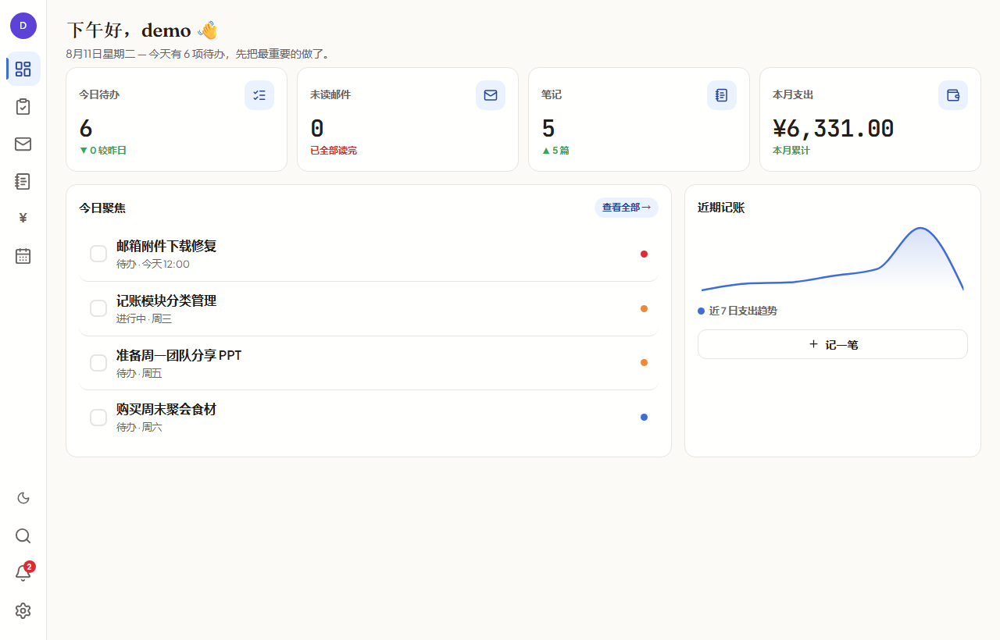
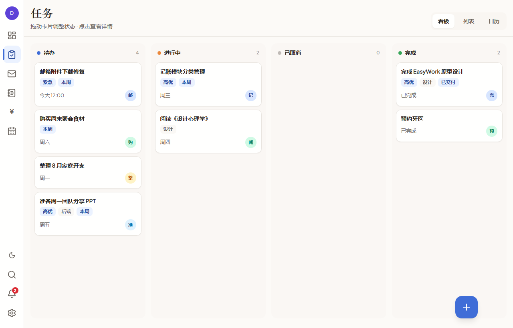
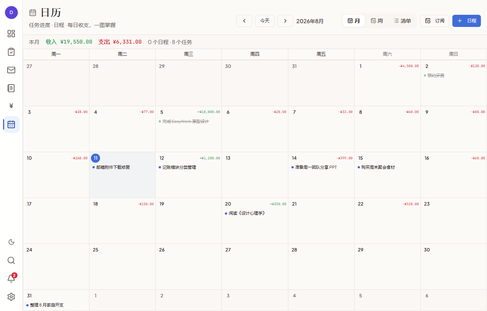
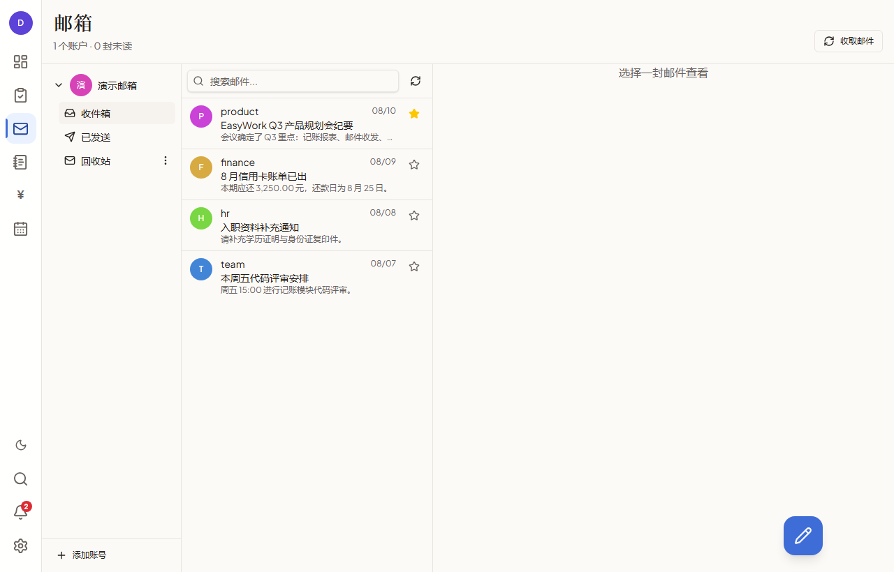
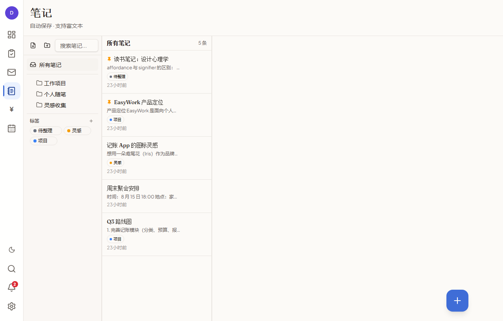
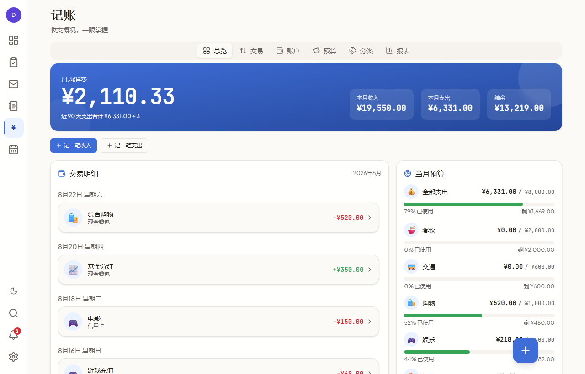
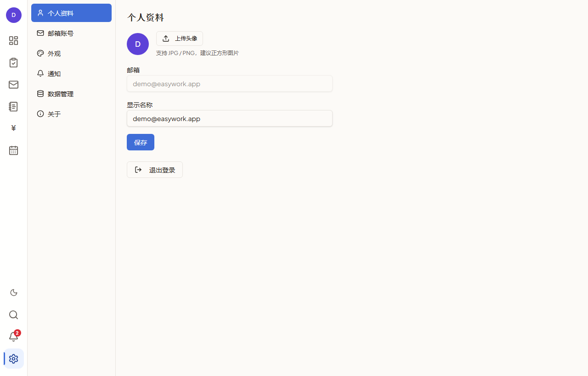

# EasyWork — 你的全能生产力工作台

> 一个应用，搞定任务、邮件、笔记、记账、日历。不再在六个工具之间来回切换。

---

## 为什么需要 EasyWork？

想象一下你典型的工作日：

早上打开 **Todoist** 看任务，切到 **Outlook** 查邮件，打开 **Notion** 记笔记，再切到 **随手记** 记账，最后用 **Google 日历** 看今天的安排。一天下来，你在 5、6 个应用之间来回切换，数据分散在各处，信息无法关联。

**EasyWork 的理念很简单：把这些常用的小工具集成到一个应用里。**

- 任务到期了？日历上直接看到。
- 收到邮件需要跟进？一键创建任务。
- 开会做了笔记？关联到对应任务。
- 出差花了钱？记账时关联到任务。

**所有数据互通，所有操作在一个窗口内完成。** 这就是 EasyWork。

---

## 目录

1. [产品概览](#1-产品概览)
2. [核心设计理念](#2-核心设计理念)
3. [功能模块详解](#3-功能模块详解)
   - 3.1 [仪表盘 Dashboard](#31-仪表盘-dashboard)
   - 3.2 [任务管理 Tasks](#32-任务管理-tasks)
   - 3.3 [日历 Calendar](#33-日历-calendar)
   - 3.4 [邮箱 Mail](#34-邮箱-mail)
   - 3.5 [笔记 Notes](#35-笔记-notes)
   - 3.6 [记账 Finance](#36-记账-finance)
   - 3.7 [设置 Settings](#37-设置-settings)
4. [跨模块联动工作流](#4-跨模块联动工作流)
5. [技术架构速览](#5-技术架构速览)

---

## 1. 产品概览

**EasyWork** 是一款面向个人和小团队的桌面端全能生产力工作台。它在同一个应用内整合了六大功能模块，让你在一个窗口里完成日常工作的所有事情。

### 一句话介绍

> 把任务管理、邮箱、笔记、记账、日历装进一个应用，数据互通，操作流畅。

### 适合谁用？

- **自由职业者**：需要同时管理项目任务、客户邮件、收支记录
- **小团队负责人**：需要跟踪团队进度、协调日程、管理预算
- **效率爱好者**：厌倦了在多个工具之间切换，想要一个统一的入口
- **学生 / 研究者**：需要管理学习任务、课程日历、研究笔记、生活开支

### 运行方式

- **桌面应用**（Windows）：下载即用，无需安装
- **网页版**：浏览器直接访问
- **Android 版**：移动端同步使用

---

## 2. 核心设计理念

### 2.1 一个应用，代替六个工具

传统方式：

```
Todoist（任务）+ Outlook（邮件）+ Notion（笔记）+ 随手记（记账）+ Google Calendar（日历）+ 文件管理器
= 6 个应用 × 6 次登录 × 6 套数据
```

EasyWork 方式：

```
EasyWork = 1 个应用 × 1 次登录 × 1 套互通数据
```

**效率提升在哪？**

| 场景 | 传统方式 | EasyWork |
|------|---------|---------|
| 收到邮件需要跟进 | 打开邮件 → 切到任务工具 → 新建任务 → 复制链接 | 邮件内一键创建任务，自动关联 |
| 查看今天安排 | 打开日历 → 打开任务工具 → 打开记账 | 仪表盘一眼看完所有 |
| 出差报销 | 打开记账 → 手动输入分类 → 打开邮件找发票 | 记账时直接关联任务和邮件 |
| 周回顾 | 逐个打开 5 个应用汇总 | 仪表盘自动生成周报数据 |

### 2.2 安静优先，一眼扫读

界面设计遵循「安静优先」原则：

- **左侧图标栏**：60px 窄侧栏，只放图标，鼠标悬停显示文字，不占用内容空间
- **信息密度高**：每个页面都尽量展示更多有用信息，减少点击层级
- **两步可达**：任何功能最多两次点击就能到达

### 2.3 实时同步，数据不丢

- 所有数据存储在云端（Supabase），多设备自动同步
- 修改后近实时刷新，无需手动刷新
- 支持数据导出/导入，你的数据永远属于你

### 2.4 深色 / 浅色 / 跟随系统

三种主题模式随意切换，深色模式护眼，浅色模式清爽，跟随系统模式省心。

---

## 3. 功能模块详解

### 3.1 仪表盘 Dashboard

> 打开应用的第一眼，今天该做什么、发生了什么，一目了然。



#### 功能说明

仪表盘是你的「今日指挥中心」，整合了所有模块的关键信息：

| 区域 | 内容 | 说明 |
|------|------|------|
| 问候语 | 动态问候 + 日期 | 根据时间段显示「早上好/下午好/晚上好」 |
| 概览卡片 ×4 | 今日待办 / 未读邮件 / 笔记篇数 / 本月支出 | 一眼掌握全局状态，含趋势对比 |
| 今日聚焦 | 前 4 条待办任务 | 点击复选框直接完成，无需跳转 |
| 近期记账 | 近 7 天支出趋势图 | 迷你折线图，快速了解消费趋势 |

#### 设计思路

仪表盘不做复杂操作，只做**信息聚合**。它回答三个问题：

1. **今天有什么要做？** → 今日聚焦列表
2. **有什么新消息？** → 未读邮件数、通知红点
3. **最近花钱情况如何？** → 近期记账趋势

#### 工作流程

```
打开应用 → 自动进入仪表盘 → 扫视概览卡片 → 处理今日聚焦任务
                                        ↓
                              点击任务跳转到任务模块
                              点击邮件跳转到邮箱模块
                              点击「记一笔」跳转到记账模块
```

---

### 3.2 任务管理 Tasks

> 从待办到完成，用最适合你的方式管理每一项工作。



#### 功能说明

任务模块提供三种视图，适应不同的工作习惯：

**看板视图（Kanban）**

- 四列布局：待办 → 进行中 → 已取消 → 完成
- 拖拽卡片即可改变任务状态
- 卡片自动显示优先级标签、分类标签、截止日期
- 智能相对日期（如「今天 12:00」「周五」）

**列表视图**

- 紧凑列表，适合快速浏览大量任务
- 勾选复选框直接完成/取消
- 显示优先级徽标、周期标记、截止日期

**日历视图**

- 按周展示，每天一列
- 直观看到每天的任务分布
- 上一周 / 今天 / 下一周 快速导航

#### 任务详情

点击任意任务打开右侧抽屉，可以：

- 编辑标题和描述
- 修改状态、优先级、截止日期
- 管理标签（多选）
- 添加/删除子任务
- 设置周期任务（每日/每周/每月）

#### 设计思路

**为什么用看板而不是简单列表？**

看板的核心优势是**状态可视化**。你不需要思考「这个任务现在是什么状态」，它在哪一列就是什么状态。拖拽操作比下拉菜单选择更直觉。

**周期任务怎么工作？**

```
设置周期规则（如每周一）
       ↓
完成任务时自动生成下一期
       ↓
继承标题和规则，日期自动推进
       ↓
到达结束日期后自动停止
```

#### 工作流程

```
新建任务 → 设置标题/优先级/截止日期/标签
    ↓
拖拽到「进行中」开始工作
    ↓
添加子任务拆解步骤
    ↓
拖拽到「完成」→ 如果是周期任务，自动生成下一期
```

---

### 3.3 日历 Calendar

> 任务进度、日程安排、每日收支，一张日历全掌握。



#### 功能说明

日历模块不只是看日期，它是**时间维度的信息聚合器**：

**三种视图**

| 视图 | 适合场景 | 特色 |
|------|---------|------|
| 月视图 | 月度规划 | 每日收支角标 + 任务/日程 chip |
| 周视图 | 周计划 | 7 列时间线，事件显示时间/地点 |
| 清单视图 | 快速浏览 | 按日期列出未来 60 天的所有事项 |

**日程管理**

- 新建/编辑日程（标题、日期、全天/定时、地点、备注、颜色、提醒）
- 7 种预置颜色区分不同类型日程
- 点击任务可跳转到任务模块

**订阅外部日历**

- 支持 ICS 链接订阅（如 Google Calendar 导出）
- 支持 CalDAV 协议（如钉钉日历）
- 自动同步，订阅事件只读显示

**收支汇总**

- 月/周视图顶部显示区间收入和支出汇总
- 每日格子右上角显示当日收支金额

#### 设计思路

**日历为什么整合收支数据？**

因为「某天花了多少钱」本身就是日程信息的一部分。比如你看到 8 月 22 日支出 ¥520，可能就想起来那天买了什么东西。时间和金钱天然关联。

#### 工作流程

```
打开日历 → 月视图概览全月
    ↓
看到某天有任务/收支 → 点击查看详情抽屉
    ↓
新建日程 → 选择日期/时间/颜色 → 保存
    ↓
订阅外部日历 → 粘贴 ICS 链接 → 自动同步
```

---

### 3.4 邮箱 Mail

> 多账号统一管理，收件、发信、草稿，一个窗口搞定。



#### 功能说明

**多账号管理**

- 支持添加多个邮箱账号（IMAP/SMTP）
- 左侧账号树按账号分组，显示未读总数
- 每个账号独立管理文件夹

**文件夹管理**

- 自动同步收件箱、已发送、回收站等系统文件夹
- 支持新建/重命名/删除自定义文件夹
- 每个文件夹显示未读邮件数

**邮件列表**

- 发件人头像（首字母）、未读小圆点、时间、主题、预览
- 星标功能，重要邮件一键标记
- 列表内搜索（按主题/发件人/预览内容过滤）

**邮件阅读**

- HTML 正文安全渲染（自动过滤脚本和危险内容）
- 附件预览和下载（支持图片、PDF）
- 一键回复/转发

**撰写发信**

- 选择发件账号
- 收件人（支持多个，逗号分隔）
- 抄送（可展开）
- 主题 + 正文
- 草稿自动保存

**邮件同步**

- 手动点击「收取邮件」即时拉取
- 后台每 5 分钟自动同步（pg_cron 定时任务）
- 增量同步，只拉取新邮件

#### 设计思路

**为什么自写 SMTP 而不是用现成库？**

因为 EasyWork 的邮件功能运行在 Supabase Edge Functions（Deno 环境）上，主流的 nodemailer 等库不兼容 Deno。手写 SMTP 客户端虽然工作量大，但确保了跨平台兼容性。

**增量同步怎么工作？**

```
首次同步 → 拉取最近 200 封邮件
    ↓
记录最后 UID 和文件夹有效性标识
    ↓
下次同步 → 只拉取 UID 大于上次记录的新邮件
    ↓
对账 → 远端已删除的邮件本地也删除
```

#### 工作流程

```
添加邮箱账号 → 配置 IMAP/SMTP 服务器信息
    ↓
自动同步文件夹和邮件
    ↓
点击邮件阅读 → 回复/转发/标星/删除
    ↓
点击撰写 → 写邮件 → 发送（同时保存到已发送）
```

---

### 3.5 笔记 Notes

> 支持富文本的笔记系统，文件夹 + 标签双维度管理。



#### 功能说明

**文件夹树**

- 支持多层级文件夹嵌套
- 可展开/折叠
- 新建、重命名、删除文件夹
- 删除文件夹时，下层笔记自动移至「未分类」

**标签系统**

- 彩色圆点标签，一眼区分
- 新建、删除标签
- 一篇笔记可关联多个标签
- 按标签筛选笔记

**笔记列表**

- 显示置顶标记、标题、正文摘要（前 50 字）、标签、相对时间
- 置顶笔记始终排在最前
- 支持按文件夹 + 标签 + 关键词三重叠加筛选

**富文本编辑器**

基于 Tiptap 的富文本编辑器，支持：

| 功能 | 说明 |
|------|------|
| 文字样式 | 加粗、斜体、删除线、行内代码 |
| 标题 | H1 / H2 / H3 |
| 列表 | 无序列表、有序列表 |
| 代码块 | 多行代码高亮 |
| 引用 | 块引用 |
| 分割线 | 内容分隔 |
| 图片 | 插入网络图片（http/https） |
| 撤销/重做 | 标准编辑操作 |

**自动保存**

- 标题 500ms 防抖保存
- 正文 1500ms 防抖自动保存
- 切换笔记或关闭前自动保存待存内容，防止丢失

**导入功能**

- 支持导入 `.txt` 和 `.md` 文件
- 文件内容直接写入笔记正文

#### 设计思路

**为什么用双维度（文件夹 + 标签）管理？**

文件夹适合**层级分类**（如「工作项目 > 项目A」），标签适合**交叉分类**（如一篇笔记同时属于「项目」和「灵感」）。两者结合，找笔记更灵活。

**自动保存的防丢失机制**

```
编辑中 → 防抖计时器启动
    ↓
1500ms 无新输入 → 自动保存到云端
    ↓
切换笔记 → 先保存当前笔记 → 再加载新笔记
    ↓
关闭应用 → flush 所有待保存内容
```

#### 工作流程

```
新建笔记 → 选择文件夹 → 输入标题和正文
    ↓
编辑器自动保存（每 1.5 秒）
    ↓
添加标签 → 方便后续检索
    ↓
需要时通过文件夹/标签/搜索找到笔记
```

---

### 3.6 记账 Finance

> 收支概况，一眼掌握。从记账到报表，全流程覆盖。



#### 功能说明

记账模块包含六个子页面，覆盖完整的个人财务管理流程：

**总览页**

- 月均消费、本月收入/支出/结余
- 当月交易时间线（按日期分组）
- 当月预算进度条
- 月度收支柱状图
- 支出分类占比饼图
- 近 7 天支出趋势折线图

**交易页**

- 分段筛选：全部 / 收入 / 支出 / 转账
- 关键词搜索（备注 + 分类名）
- 分类下拉筛选
- 账户下拉筛选
- 时间线分组倒序展示

**记账表单**

- 支出 / 收入 / 转账 三种类型
- 金额输入 + 实时预览
- 快速记账按钮（10/20/50/100/200/500）
- 分类图标网格选择（支持多级父子分类）
- 账户选择（转账时需选转出和转入账户）
- 日期选择
- 备注
- 收据照片上传

**账户管理**

- 总资产 Hero 展示
- 现金 / 银行卡 / 信用卡 三类账户
- 计算余额（基于交易记录自动计算）
- 添加 / 编辑 / 删除账户

**预算管理**

- 整体月度上限（含滚动）
- 按分类设置预算
- 上月结余自动滚动到本月
- 进度条（超支变红、接近变黄、正常绿色）
- 超支时自动发送通知提醒

**分类管理**

- 支出 / 收入分类切换
- 多级分类树（递归缩进显示）
- 30 种 emoji 图标可选
- 新建 / 编辑 / 删除分类
- 防循环引用（父级排除自身及后代）

**报表页**

- 月份选择
- 月度收支对比柱状图
- 支出分类占比饼图
- 收支趋势折线图（所选月份每一天）
- 导出 CSV（UTF-8 BOM 编码，Excel 直接打开不乱码）

#### 设计思路

**为什么金额用整数分存储？**

浮点数计算有精度问题（如 `1.005.toFixed(2)` 在 JavaScript 中会得到 `"1.00"` 而非 `"1.01"`）。EasyWork 将所有金额转换为整数分（如 ¥123.45 → 12345 分）进行计算，最后再格式化显示，彻底避免浮点漂移。

**预算滚动怎么工作？**

```
月末 → 计算「预算额度 - 实际支出」
    ↓
结余为正 → 带入下月（可多花）
结余为负 → 带入下月（需少花）
    ↓
下月有效预算 = 本月预算 + 滚动结余
```

#### 工作流程

```
记一笔 → 选择类型（支出/收入/转账）
    ↓
输入金额 → 选择分类 → 选择账户 → 添加备注
    ↓
可选：上传收据照片
    ↓
保存 → 自动更新账户余额和预算进度
    ↓
月末查看报表 → 导出 CSV 备份
```

---

### 3.7 设置 Settings

> 个性化配置、数据管理，一切尽在掌控。



#### 功能说明

设置模块包含七个 Tab 页：

| Tab | 功能 |
|-----|------|
| 个人资料 | 头像上传、显示名称修改 |
| 邮箱账号 | 查看已添加的邮箱账号列表 |
| 外观 | 浅色 / 深色 / 跟随系统 三选一 |
| 通知 | 任务提醒、邮件通知、预算警告开关 |
| 数据管理 | 导出全部数据（JSON）、导入数据、清空数据 |
| 关于 | 应用版本、运行环境信息 |

**数据导出**

- 导出 16 张业务表的完整数据为 JSON
- 自动剔除密码等敏感信息
- 可用于备份或迁移

**数据导入**

- 导入 JSON 数据文件
- 自动将数据关联到当前用户
- 导入后自动刷新所有模块

#### 工作流程

```
打开设置 → 选择对应 Tab
    ↓
修改配置 → 保存
    ↓
数据管理 → 导出 JSON 备份
    ↓
换设备时 → 导入 JSON 恢复数据
```

---

## 4. 跨模块联动工作流

EasyWork 的核心优势在于模块之间的数据互通。以下是几个典型的跨模块工作流：

### 4.1 邮件 → 任务联动

```
收到客户邮件要求修改方案
    ↓
在邮件阅读界面点击「创建任务」
    ↓
自动带入邮件主题作为任务标题
    ↓
设置截止日期和优先级
    ↓
任务出现在看板和日历中
    ↓
完成后在邮件中回复客户
```

### 4.2 任务 → 日历联动

```
创建任务「周五前完成报告」
    ↓
日历视图自动显示该任务
    ↓
点击日历上的任务 → 跳转到任务详情
    ↓
在任务中添加子任务拆解步骤
    ↓
完成后日历自动更新状态
```

### 4.3 记账 → 任务联动

```
出差产生费用
    ↓
记账时选择关联任务「Q3 客户拜访」
    ↓
任务详情中可查看关联支出
    ↓
报表中可按任务筛选支出
```

### 4.4 仪表盘 → 全局搜索

```
在仪表盘点击搜索图标
    ↓
输入关键词（如「报告」）
    ↓
跨模块搜索：任务标题/描述、笔记标题/正文、记账备注
    ↓
点击结果直接跳转到对应模块和具体条目
```

### 4.5 通知中心

```
预算超支 → 黄色通知
任务即将到期 → 蓝色通知
新邮件到达 → 绿色通知
    ↓
点击通知直接跳转到对应模块
    ↓
已读通知可标记为已读或全部已读
```

---

## 5. 技术架构速览

> 给技术读者看的快速概览。

### 技术栈

| 层 | 技术 |
|---|---|
| 前端框架 | React 19 + TypeScript |
| 构建工具 | Vite 5 + Tailwind CSS v4 |
| 路由 | TanStack Router |
| 数据缓存 | TanStack Query v5 |
| 全局状态 | Zustand（仅认证和实时连接状态） |
| UI 组件 | shadcn/ui + Radix |
| 富文本 | Tiptap |
| 拖拽 | @dnd-kit |
| 图表 | Recharts |
| 后端 | Supabase（PostgreSQL + Auth + Realtime + Storage） |
| 服务端函数 | Supabase Edge Functions（Deno） |
| 桌面封装 | Tauri v2（Rust） |
| 测试 | Vitest + Testing Library |

### 架构分层

```
─────────────────────────────────────────┐
│              客户端 (React SPA)            │
│  UI 组件 → TanStack Query → Supabase 客户端 │
└──────────────────┬──────────────────────┘
                   │ REST / WebSocket
┌──────────────────▼──────────────────────┐
│              Supabase 后端                │
│  PostgreSQL + Auth + Realtime + Storage   │
│  Edge Functions (IMAP/SMTP/CalDAV 代理)    │
└─────────────────────────────────────────┘
```

### 数据安全

- 所有数据通过 RLS（行级安全）按用户隔离
- 密码使用加密存储
- 导出时自动剔除敏感信息
- HTML 内容经 DOMPurify 净化，防止 XSS 攻击

### 实时同步

```
用户 A 修改任务 → Supabase Realtime 推送变更
                                    ↓
用户 B 的 TanStack Query 自动失效 → 重新拉取 → 界面更新
```

---

*文档结束。EasyWork — 一个应用，搞定一切。*
