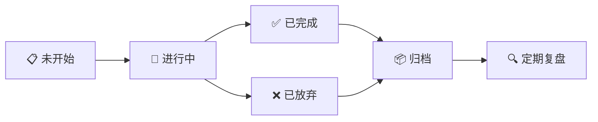

# EasyWork 软件设计文档

> [!info] 项目概览
> **EasyWork** 是一款基于 **Tauri + React + Rust** 技术栈开发的跨平台个人效率工具，适配 **Windows** 与 **Android** 双平台。
> 软件整合了任务管理、日程规划、邮件处理、笔记记录、股票盯盘、记账管理和运动追踪等核心功能，致力于打造一站式个人工作与生活管理中心。

---

## 一、技术架构

> [!tip] 技术选型原则
> 所有技术栈必须选用**最新稳定发行版**，确保项目处于活跃维护状态，禁止使用已停止维护或老旧版本的依赖。

### 1.1 核心技术栈


### 1.2 平台适配

- **Windows**：完整桌面端体验，支持窗口化/全屏模式,托盘图标，后台常驻，关闭默认最小化到任务栏（设置中可修改），系统通知。
- **Android**：移动端适配，触控优化，支持系统级通知。

> [!warning] 版本约束
> - 禁止使用已停止维护（Deprecated / Archived）的项目
> - 禁止锁定老旧版本（存在已知安全漏洞或性能缺陷）
> - 优先选择社区活跃、文档完善的技术方案

---

## 二、UI 布局设计

![[ui-layout.png]]

### 2.1 整体布局结构

采用经典的**左侧导航 + 右侧内容**布局模式：

```
┌─────────────────────────────────────────────────────────┐
│  [Sidebar]  │  [Main Content Area]                      │
│             │                                           │
│  🏠 Dashboard │  ┌─────────────────────────────────┐    │
│  📋 看板      │  │  Dashboard / 功能页面内容        │    │
│  📅 日历      │  │                                 │    │
│  ✉️ 邮箱      │  │  （根据选中导航项动态切换）       │    │
│  📝 笔记      │  │                                 │    │
│  📈 股票      │  └─────────────────────────────────┘    │
│  💰 记账      │                                           │
│  🏃 运动      │                                           │
│  📜 日志      │                                           │
│  ─────────  │                                           │
│  ⚙️ 设置      │                                           │
└─────────────────────────────────────────────────────────┘
```

### 2.2 左侧导航栏（Sidebar）

| 属性 | 说明 |
|------|------|
| 宽度 | 窄边设计（约 64px 图标模式 / 可展开至 200px） |
| 展示形式 | 图标 + 文字标签（悬停/展开时显示） |
| 默认状态 | 图标模式，节省屏幕空间 |

**功能入口列表：**

| 图标 | 名称 | 说明 |
|------|------|------|
| 🏠 | Dashboard | 数据汇总总览页 |
| 📋 | 看板 | 任务管理与追踪 |
| 📅 | 日历 | 日程规划与展示 |
| ✉️ | 邮箱 | 邮件收发与管理 |
| 📝 | 笔记 | 富文本笔记记录 |
| 📈 | 股票 | 行情盯盘与自选 |
| 💰 | 记账 | 收支记录与统计 |
| 🏃 | 运动记录 | 运动数据追踪 |
| 📜 | 日志 | 调试日志查看（开发/排障使用） |
| ⚙️ | 设置 | 系统配置（默认靠下排列） |

> [!note] 导航栏交互
> - 支持折叠/展开切换
> - 当前选中项高亮显示
> - 支持拖拽排序（用户自定义）

### 2.3 响应式布局要求

- **桌面端（≥1024px）**：完整侧边栏 + 主内容区
- **平板端（768px–1023px）**：可折叠侧边栏 + 主内容区
- **移动端（<768px）**：底部 Tab 导航 + 全屏内容区

---

## 三、功能模块详解

### 3.1 Dashboard（数据总览）

Dashboard 作为应用的**首页与数据中枢**，聚合展示各模块的核心数据。

#### 3.1.1 顶部统计卡片

| 卡片   | 数据来源 | 展示内容              |
| ---- | ---- | ----------------- |
| 今日待办 | 看板模块 | 待办任务数量 + 紧急任务标记   |
| 今日日程 | 日历模块 | 今日日程数量 + 下一项日程倒计时 |
| 消费金额 | 记账模块 | 昨日支出 / 本月预算使用率    |
| 运动步数 | 运动模块 | 近30天运动情况 / 目标完成率  |

#### 3.1.2 股票行情概览

- 自选股涨跌幅列表（红涨绿跌）
- 迷你走势图（Sparkline）
- 点击跳转至股票详情页

#### 3.1.3 快捷入口

- ➕ 快速添加任务
- 📝 快速记录笔记
- 🏃 快速记录运动
- 💰 快速记账

> [!example] Dashboard 数据聚合逻辑
> Dashboard 本身不存储数据，所有展示内容通过各模块 API 实时聚合，确保数据一致性。

---

### 3.2 看板（任务管理）

看板模块提供完整的**任务生命周期管理**，从创建到归档的全流程追踪。

#### 3.2.1 任务状态泳道



| 状态  | 说明           |
| --- | ------------ |
| 未开始 | 已创建但尚未启动的任务  |
| 进行中 | 已开始执行，正在追踪进度 |
| 已完成 | 已达成目标，等待归档   |
| 已放弃 | 经论证后决定终止的任务  |
| 归档  | 已完成或已放弃的任务集合 |

#### 3.2.2 任务卡片字段

| 字段 | 类型 | 说明 |
|------|------|------|
| 任务标题 | 文本 | 简短描述任务内容 |
| 负责人 | 文本/选择 | 任务执行责任人 |
| 开始时间 | 日期时间 | 任务启动时间 |
| 当前运行时间 | 自动计算 | 从开始到现在的累计时长 |
| 结束时间 | 日期时间 | 任务实际完成时间 |
| 完成评分 | 1-5 星 | 任务完成质量评估 |
| 重要程度 | 高/中/低 | 任务重要性评级 |
| 紧急程度 | 高/中/低 | 任务紧急性评级（艾森豪威尔矩阵） |
| 难易程度 | 高/中/低 | 任务执行难度评估 |
| Timeline | 时间轴 | 任务执行过程的关键节点记录 |
| 附件 | 文件列表 | 支持上传相关文档、图片等 |

#### 3.2.3 定期复盘功能

> [!tip] 复盘机制
> - 每周/每月自动生成复盘报告
> - 统计已完成、已放弃任务的数量与比例
> - 分析任务平均完成时长、评分分布
> - 提供改进建议（基于历史数据）

---

### 3.3 日历

日历模块提供**多维度时间视图**，集成展示各类日程与事件。

#### 3.3.1 核心功能

| 功能     | 说明              |
| ------ | --------------- |
| 日程展示   | 支持日/周/月/年视图切换   |
| 待办集成   | 看板中的任务按截止日期显示   |
| 消费记录   | 记账模块的支出按日期标注    |
| 运动情况   | 运动记录按日期展示       |
| 农历显示   | 支持中国传统农历日期      |
| 法定节假日  | 自动标注中国法定节假日     |
| 钉钉日程订阅 | 支持订阅钉钉日历，同步企业日程 |

#### 3.3.2 视图模式

- **日视图**：24 小时时间轴，详细展示每小时安排
- **周视图**：7 天并列，适合规划周计划
- **月视图**：整月概览，适合查看整体安排

> [!example] 集成展示示例
> 在月视图中，某天可能同时显示：
> - 📝 上午会议（日程）
> - 📋 完成项目报告（待办）
> - 💰 午餐支出 ¥35（消费）
> - 🏃 晚间跑步 5km（运动）

---

### 3.4 邮箱

邮箱模块参照 **Pebble 项目** 的设计理念，提供简洁高效的邮件管理体验。

#### 3.4.1 核心功能

| 功能       | 说明            |
| -------- | ------------- |
| 邮件同步     | IMAP 协议支持     |
| 邮件接收     | 实时推送新邮件通知     |
| 邮件发送     | SMTP 协议发送邮件   |
| 转发       | 一键转发邮件        |
| 回复       | 支持回复/回复全部     |
| 多账号管理    | 支持配置多个邮箱账号    |
| 统一收件夹    | 多账号邮件聚合展示     |
| 联系人管理    | 新增、编辑、删除联系人   |
| VCF 导入导出 | 标准 vCard 格式支持 |
| 分组管理     | 联系人分类分组       |
| 个性签名     | 自定义邮件签名模板     |

#### 3.4.2 邮件视图

- **收件箱**：统一收件夹，按时间倒序排列
- **已发送**：发送记录归档
- **草稿箱**：未发送的草稿邮件
- **垃圾箱**：已删除邮件（保留 30 天）
- **联系人**：通讯录管理界面

#### 3.4.3 其他事宜
	添加账户：录入邮箱账号，当录入焦点离开“邮箱账号”栏的时候，自动取值@以前的作为用户名（可修改），@以后的值来判别邮箱服务商，自动填充IMAP、SMTP地址、端口信息，若未识别则由人工填写，集成主流邮箱服务商，添加账户页面中显示同步周期（默认近1个月，可以修改），同步间隔（默认5分钟，可以修改）

---

### 3.5 笔记

笔记模块提供**富文本编辑与知识管理**能力。

#### 3.5.1 核心功能

| 功能 | 说明 |
|------|------|
| 富文本编辑 | 支持标题、列表、引用、代码块等格式 |
| 图片插入 | 支持粘贴/上传图片 |
| 附件支持 | 支持关联文件附件 |
| 分类管理 | 文件夹/标签双维度分类 |
| 全文搜索 | 支持标题和内容关键词搜索 |
| 快速创建 | 支持快捷键/命令面板快速新建笔记 |
| 历史版本 | 自动保存编辑历史，支持版本回溯 |

#### 3.5.2 编辑器特性

- **Markdown 支持**：兼容标准 Markdown 语法
- **实时预览**：编辑与预览双栏模式
- **专注模式**：隐藏干扰元素，专注写作
- **导出功能**：支持导出为 PDF / Markdown / HTML

---

### 3.6 股票

股票模块提供**实时行情盯盘与投资管理**功能。

#### 3.6.1 核心功能

| 功能 | 说明 |
|------|------|
| 实时行情 | 股票实时价格、涨跌幅、成交量 |
| 自选股管理 | 自定义关注股票列表 |
| 涨跌幅提醒 | 设置价格阈值，触发通知 |
| K 线图展示 | 支持日 K / 周 K / 月 K |
| 技术指标 | MA / MACD / KDJ / RSI 等 |
| 新闻资讯 | 关联个股相关新闻 |

#### 3.6.2 数据来源

- 优先对接免费股票 API（如新浪财经、腾讯财经）
- 支持用户配置私有数据源

> [!warning] 数据免责声明
> 股票行情数据仅供参考，不构成投资建议。用户应自行承担投资风险。

---

### 3.7 记账

记账模块提供**个人财务管理**功能，帮助用户掌握收支状况。

#### 3.7.1 核心功能

| 功能 | 说明 |
|------|------|
| 收支记录 | 快速记录每笔收入与支出 |
| 分类管理 | 预设分类（餐饮/交通/购物等），支持自定义 |
| 统计图表 | 收支趋势图、分类饼图、月度对比图 |
| 预算管理 | 按分类/月度设置预算，超支预警 |
| 账单导入 | 支持支付宝/微信账单 CSV 导入 |
| 数据导出 | 导出为 Excel / CSV 格式 |

#### 3.7.2 统计维度

- **日统计**：每日收支汇总
- **周统计**：本周与上周对比
- **月统计**：月度收支报表
- **年统计**：年度财务总结
- **分类统计**：各消费类别占比分析

---

### 3.8 运动记录

运动记录模块提供**基础运动数据追踪与同步**功能。

#### 3.8.1 核心功能

| 功能 | 说明 |
|------|------|
| 基础记录 | 手动记录运动类型、时长、距离、消耗卡路里 |
| 运动类型 | 跑步/骑行/游泳/健身/瑜伽等 |
| 目标设定 | 每日/每周运动目标 |
| 历史统计 | 运动数据趋势分析 |
| 华为运动同步 | 对接华为运动健康 API |
| Keep 同步 | 对接 Keep 运动数据接口 |

#### 3.8.2 支持的运动类型

- 🏃 跑步
- 🚴 骑行
- 🏋️ 健身
- 🎾 球类运动

> [!tip] 同步说明
> 华为运动与 Keep 同步需要用户授权登录对应账号，数据将定期自动同步。

---

### 3.9 日志（调试）

日志模块为**开发与排障专用**，提供详细的系统运行日志。

#### 3.9.1 功能说明

| 功能 | 说明 |
|------|------|
| 日志级别 | DEBUG / INFO / WARN / ERROR |
| 实时刷新 | 日志实时追加显示 |
| 筛选过滤 | 按级别/模块/时间范围筛选 |
| 日志导出 | 导出为文本文件 |
| 日志清理 | 自动清理超过 30 天的旧日志 |

> [!warning] 用户提示
> 日志模块主要面向开发者与高级用户，普通用户无需关注。

---

### 3.10 设置

设置模块提供**系统级配置管理**。

#### 3.10.1 配置项

| 分类  | 配置项                      |
| --- | ------------------------ |
| 通用  | 语言选项、主题（浅色/深色/跟随系统）、启动行为 |
| 账号  | 邮箱账号、运动平台账号、股票数据源        |
| 通知  | 邮件通知、任务提醒、股票预警           |
| 数据  | 备份/恢复、导出、存储位置            |
| 关于  | 版本信息、更新检查、开源许可           |

---

