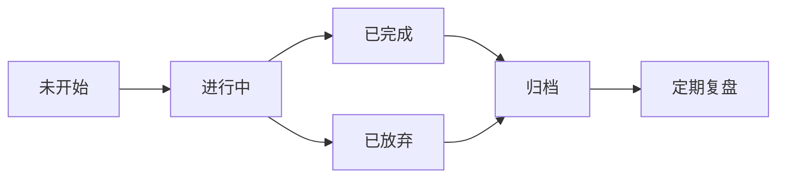

# EasyWork 技术设计文档

> **项目名称：** EasyWork - 跨平台个人效率工具
> **版本：** 1.0.0
> **日期：** 2026-06-09
> **状态：** 已审批，待实施

---

## 一、项目概述

EasyWork 是一款基于 **Tauri + React + Rust** 技术栈开发的跨平台个人效率工具，适配 **Windows** 与 **Android** 双平台。整合任务管理、日程规划、邮件处理、笔记记录、股票盯盘、记账管理和运动追踪等核心功能，致力于打造一站式个人工作与生活管理中心。

### 1.1 关键决策记录

| 决策项 | 选择 | 理由 |
|--------|------|------|
| 开发节奏 | UI 先行，全模块铺开 | 快速看到整体效果，再逐步深入各模块 |
| UI 组件库 | MUI (Material-UI) | 组件丰富、与 React 生态集成好 |
| 前端架构 | qiankun 微前端 | 模块边界清晰、可独立部署/更新 |
| 状态管理 | React Context + useReducer | 轻量简单、适合中小规模状态 |
| 数据存储 | SQLite (rusqlite) | Tauri 原生支持、性能好、结构化查询 |
| 视觉风格 | 现代简约 + 暗/亮主题切换 | 类 Notion/Linear 风格、大量留白、圆角卡片 |
| 侧边栏模式 | 固定 60px 图标模式（无展开态） | 节省空间、hover tooltip 显示名称 |

### 1.2 平台适配

- **Windows**：完整桌面端体验，支持窗口化/全屏模式、托盘图标、后台常驻、系统通知
- **Android**：移动端适配，触控优化，支持系统级通知

### 1.3 版本约束

- 必须使用最新稳定版技术栈
- 禁止使用已停止维护或存在安全漏洞的依赖
- 优先选择社区活跃、文档完善的技术方案

---

## 二、技术架构

### 2.1 核心技术栈

| 层级 | 技术 | 版本要求 | 用途 |
|------|------|----------|------|
| 桌面壳 | Tauri 2.x | 最新稳定版 | 跨平台桌面/移动端运行时 |
| 前端框架 | React 19 | ^19.x | UI 渲染 |
| 构建工具 | Vite 6.x | ^6.x | 开发服务器 & 构建 |
| 微前端 | qiankun 3.x (或 2.x 稳定版) | ^3.x / ^2.x | 子应用加载与隔离 |
| UI 组件库 | MUI 6.x | ^6.x | Material Design 组件 |
| 状态管理 | React Context + useReducer | 内置 | 子应用内部状态 |
| 语言 | TypeScript 5.x | ^5.x | 类型安全 |
| 包管理 | pnpm | ^9.x | Monorepo 工作区 |
| 数据库 | SQLite (rusqlite) | Rust 侧 | 本地持久化存储 |
| 样式方案 | MUI sx prop + CSS Modules | - | 样式隔离 |

### 2.2 项目目录结构

```
e:\Dev\EasyWork/
├── apps/                          # 微前端子应用
│   ├── main/                      # 主 Shell 应用（qiankun 容器）
│   │   ├── src/
│   │   │   ├── App.tsx            # 根组件
│   │   │   ├── layouts/
│   │   │   │   └── MainLayout.tsx # 主布局
│   │   │   ├── components/
│   │   │   │   ├── Sidebar.tsx    # 固定 60px 图标导航栏
│   │   │   │   └── ThemeProvider.tsx
│   │   │   └── micro/
│   │   │       └── registerApps.ts # qiankun 子应用注册
│   │   ├── package.json
│   │   └── vite.config.ts
│   ├── app-dashboard/             # Dashboard 模块
│   ├── app-kanban/                # 看板模块
│   ├── app-calendar/              # 日历模块
│   ├── app-mail/                  # 邮箱模块
│   ├── app-notes/                 # 笔记模块
│   ├── app-stock/                 # 股票模块
│   ├── app-accounting/            # 记账模块
│   ├── app-sports/                # 运动记录模块
│   ├── app-logs/                  # 日志模块
│   └── app-settings/              # 设置模块
│
├── shared/                        # 共享代码包
│   ├── src/
│   │   ├── types/                 # 共享 TypeScript 类型
│   │   ├── utils/                 # 工具函数
│   │   ├── hooks/                 # 自定义 Hooks
│   │   ├── constants/             # 常量/枚举
│   │   └── components/            # 共享 UI 组件
│   └── package.json
│
├── src-tauri/                     # Tauri / Rust 后端
│   ├── src/
│   │   ├── main.rs                # Tauri 入口
│   │   ├── lib.rs                 # 库入口
│   │   ├── commands/              # Tauri Commands（IPC 接口）
│   │   │   ├── mod.rs
│   │   │   ├── task.rs
│   │   │   ├── calendar.rs
│   │   │   ├── mail.rs
│   │   │   ├── note.rs
│   │   │   ├── stock.rs
│   │   │   ├── accounting.rs
│   │   │   ├── sports.rs
│   │   │   └── settings.rs
│   │   ├── db/                    # 数据库层
│   │   │   ├── mod.rs
│   │   │   ├── connection.rs      # 连接池管理
│   │   │   ├── migrations/        # 数据库迁移脚本
│   │   │   └── models/            # 数据模型
│   │   └── services/              # 业务逻辑层
│   ├── Cargo.toml
│   └── tauri.conf.json
│
├── package.json                   # 根 package.json (pnpm workspace)
├── pnpm-workspace.yaml
├── tsconfig.base.json
├── .gitignore
└── docs/
```

### 2.3 架构通信图

```
┌─────────────────────────────────────────────────────────────┐
│                      Tauri Desktop App                       │
│                                                             │
│  ┌──────────────┐     IPC (invoke)      ┌────────────────┐  │
│  │  React Frontend│ ◄──────────────────► │  Rust Backend   │  │
│  │  (qiankun)    │                       │  (Commands)    │  │
│  │               │                       │                │  │
│  │ ┌───────────┐ │                       │ ┌────────────┐ │  │
│  │ │ Main Shell│ │                       │ │  SQLite DB │ │  │
│  │ │ (容器)     │ │                       │ │ (本地存储)  │ │  │
│  │ ├───────────┤ │                       │ └────────────┘ │  │
│  │ │ Micro-Apps│ │                       │ ┌────────────┐ │  │
│  │ │ • Dashboard│ │                      │ │ HTTP Client│ │  │
│  │ │ • Kanban  │ │                       │ │ (邮件/股票) │ │  │
│  │ │ • Calendar│ │                       │ └────────────┘ │  │
│  │ │ • Mail    │ │                       │                │  │
│  │ │ • Notes   │ │                       │                │  │
│  │ │ • Stock   │ │                       │                │  │
│  │ │ • Account │ │                       │                │  │
│  │ │ • Sports  │ │                       │                │  │
│  │ │ • Logs    │ │                       │                │  │
│  │ │ • Settings│ │                       │                │  │
│  │ └───────────┘ │                       └────────────────┘  │
│  └──────────────┘                                            │
└─────────────────────────────────────────────────────────────┘
```

---

## 三、主 Shell 设计

### 3.1 侧边栏导航

采用**固定 60px 图标模式**，不支持展开/折叠切换。

| 属性 | 值 |
|------|-----|
| 宽度 | **固定 60px** |
| 图标尺寸 | 20×20px |
| 文字显示 | 始终隐藏，通过 hover **tooltip** 显示 |
| 选中指示 | 左侧 3px 渐变条 (#5BCFC4 → #1E5DA8) + 高亮背景 |
| 背景 | 深色渐变 (#1a1a2e → #16213e → #0f3460) |
| Logo | 居中 32px 渐变方块 "EW" |

**导航项列表（共 11 项）：**

| 序号 | 图标 | 名称 | 路由标识 |
|------|------|------|----------|
| 1 | 🏠 | Dashboard | dashboard |
| 2 | 📋 | 看板 | kanban |
| 3 | 📅 | 日历 | calendar |
| 4 | ✉️ | 邮箱 | mail |
| 5 | 📝 | 笔记 | notes |
| 6 | 📈 | 股票 | stock |
| 7 | 💰 | 记账 | accounting |
| 8 | 🏃 | 运动 | sports |
| 9 | 📜 | 日志 | logs |
| 10 | — | 分隔线 | — |
| 11 | ⚙️ | 设置 | settings |

### 3.2 主题系统

三档主题切换：

| 模式 | 说明 |
|------|------|
| Light | 明亮清新风格 |
| Dark | 暗色科技风格 |
| System | 跟随操作系统 |

**色彩系统：**

| 用途 | 色值 |
|------|------|
| Primary 渐变起点 | `#5BCFC4` (Teal) |
| Primary 渐变终点 | `#1E5DA8` (Blue) |
| Secondary (警告/强调) | `#FF6B6B` (珊瑚红) |
| Success (完成/正向) | `#51CF66` (绿色) |
| Warning (提醒) | `#FFD43B` (琥珀色) |
| Error (错误) | `#FF6B6B` (红色) |
| Background (Light) | `#F5F5F5` |
| Surface (Light) | `#FFFFFF` |
| Text (Light) | `#212121` |
| Background (Dark) | `#0d1117` |
| Surface (Dark) | `#161b22` |
| Text (Dark) | `#E0E0E0` |

### 3.3 响应式布局

| 断点 | 布局方式 |
|------|----------|
| >= 1024px (桌面端) | 60px 侧边栏 + 主内容区 |
| 768px–1023px (平板端) | 侧边栏可隐藏 + 主内容区 |
| < 768px (移动端) | 底部 Tab 导航 + 全屏内容区 |

### 3.4 原型文件

UI 原型位于 [prototype.html](../../prototype.html)，可通过本地 HTTP 服务预览。

---

## 四、功能模块设计

### 4.1 Dashboard（数据总览）

**定位：** 应用首页与数据中枢，聚合展示各模块核心数据。

**页面结构：**
1. **顶部统计卡片（4 个）：**
   - 今日待办（来自看板）：数量 + 紧急标记
   - 今日日程（来自日历）：数量 + 下一项倒计时
   - 消费金额（来自记账）：昨日支出 / 本月预算使用率
   - 运动步数（来自运动）：近30天情况 / 目标完成率
2. **快捷操作（4 个按钮）：** 快速添加任务、记录笔记、快速记账、运动记录
3. **自选股行情概览：** 涨跌幅列表（红涨绿跌），点击跳转股票模块

**数据策略：** Dashboard 不存储数据，所有展示内容通过各模块 API 实时聚合。

**核心组件：** `StatCard`, `QuickActions`, `StockTicker`

---

### 4.2 看板（任务管理）

**定位：** 完整的任务生命周期管理。

**状态泳道（5 列）：**



| 状态 | 说明 |
|------|------|
| 未开始 | 已创建但尚未启动 |
| 进行中 | 正在执行，追踪进度 |
| 已完成 | 达成目标，等待归档 |
| 已放弃 | 经论证后终止 |
| 归档 | 已完成/已放弃的集合 |

**任务卡片字段：**

| 字段 | 类型 | 说明 |
|------|------|------|
| title | text | 任务标题 |
| description | text | 详细描述 |
| priority | enum | 重要程度: high/medium/low |
| urgency | enum | 紧急程度: high/medium/low (艾森豪威尔矩阵) |
| difficulty | enum | 难易程度: high/medium/low |
| assignee | text | 负责人 |
| start_time | datetime | 开始时间 |
| due_time | datetime | 截止时间 |
| completed_at | datetime | 完成时间 |
| rating | int(1-5) | 完成评分 |
| status | enum | 当前状态 |
| attachments | list | 附件列表 |

**交互特性：** 卡片跨泳道拖拽、点击展开详情面板、批量操作。

**核心组件：** `KanbanBoard`, `TaskCard`, `TaskDialog`, ` EisenhowerMatrix`

---

### 4.3 日历

**定位：** 多维度时间视图，集成展示各类日程与事件。

**视图模式：**
- **日视图：** 24 小时时间轴
- **周视图：** 7 天并列
- **月视图：** 整月概览（默认视图）

**集成展示（月视图中同天可叠加显示）：**
- 日程事件（📝 会议等）
- 看板任务截止日期（📋）
- 记账支出（💰）
- 运动记录（🏃）

**特殊功能：**
- 农历日期显示
- 中国法定节假日标注
- 钉钉日程订阅（可选）

**核心组件：** `CalendarGrid`, `CalendarTimeline`, `EventChip`, `EventDetailPanel`

---

### 4.4 邮箱

**定位：** 参照 Pebble 设计理念的简洁高效邮件管理。

**布局：** 经典三栏布局（文件夹列表 + 邮件列表 + 阅读面板）

**文件夹：**
- 收件箱（统一多账号）、已发送、草稿箱、垃圾箱（保留 30 天）、联系人

**核心功能：**
- IMAP/SMTP 协议收发
- 多账号管理与统一收件箱
- 自动识别邮箱服务商并填充 IMAP/SMTP 配置
- 联系人管理（CRUD + VCF 导入导出 + 分组）
- 自定义邮件签名

**添加账户流程：** 输入邮箱 → 自动解析@前后 → 识别服务商 → 自动填充配置 → 用户确认

**核心组件：** `MailFolderList`, `MailList`, `MailReader`, `ComposeDialog`, `ContactManager`

---

### 4.5 笔记

**定位：** 富文本编辑与知识管理。

**布局：** 左右分栏（目录树 + 编辑器区域）

**核心功能：**
- 富文本编辑器（基于 Tiptap）
- Markdown 支持与实时预览
- 文件夹/标签双维度分类
- 全文搜索（标题+内容）
- 图片粘贴/上传
- 附件关联
- 历史版本回溯
- 导出为 PDF/Markdown/HTML

**核心组件：** `NoteTree`, `NoteList`, `NoteEditor`(Tiptap)

---

### 4.6 股票

**定位：** 实时行情盯盘与投资管理。

**页面结构：**
1. **K 线图区域：** 支持日 K / 周 K / 月 K 切换，技术指标叠加（MA/MACD/KDJ/RSI）
2. **自选股列表：** 名称、最新价、涨跌幅、成交额
3. **涨跌幅预警设置**

**数据来源：** 优先免费 API（新浪财经、腾讯财经），支持用户配置私有数据源。

**免责声明：** 行情数据仅供参考，不构成投资建议。

**核心组件：** `StockChart`(lightweight-charts), `StockTable`, `StockAlertDrawer`

---

### 4.7 记账

**定位：** 个人财务管理。

**页面结构：**
1. **概览区：** 本月收入/支出/结余 + 预算进度条
2. **流水列表：** 按日期倒序的收支明细
3. **操作：** 快速记账、导入账单（支付宝/微信 CSV）、统计分析

**预设分类：** 餐饮、交通、购物、娱乐、医疗、教育、居住、通讯、其他

**统计维度：** 日/周/月/年/分类 统计图表

**核心组件：** `AccountingOverview`, `TransactionList`, `AddTransactionDialog`, `CategoryPieChart`

---

### 4.8 运动记录

**定位：** 基础运动数据追踪。

**支持运动类型：** 跑步、骑行、健身、球类运动

**页面结构：**
1. **目标概览：** 每周目标设定 + 完成率进度条
2. **趋势图：** 近期运动数据折线图
3. **记录列表：** 手动记录的运动数据

**同步功能（需用户授权）：**
- 华为运动健康 API
- Keep 运动数据接口

**每条记录字段：** 运动类型、时长、距离、消耗卡路里、日期、备注

**核心组件：** `SportsOverview`, `SportsTrendChart`, `SportRecordList`, `AddSportDialog`

---

### 4.9 日志（调试）

**定位：** 开发与排障专用模块。

**功能：**
- 四级别筛选：DEBUG / INFO / WARN / ERROR
- 模块筛选：mail-sync / imap / db 等
- 实时追加显示
- 导出文本文件
- 自动清理超过 30 天的旧日志

**面向人群：** 开发者与高级用户。

**核心组件：** `LogLevelFilter`, `ModuleFilter`, `LogViewer`

---

### 4.10 设置

**定位：** 系统级配置管理。

**配置分区：**

| 分区 | 配置项 |
|------|--------|
| 外观 | 主题模式(亮/暗/跟随)、语言 |
| 通知 | 邮件通知开关、任务提醒、股票预警 |
| 账号 | 邮箱账号管理、运动平台账号、股票数据源 |
| 数据 | 备份/恢复、导出、存储位置查看 |
| 关于 | 版本信息、更新检查、开源许可 |
| 启动行为 | 启动时最小化到托盘、关闭时最小化而非退出 |

**布局：** 左侧导航 + 右侧配置面板（类似 VS Code 设置页）

**核心组件：** `SettingsNav`, `SettingsPanel`

---

## 五、数据层设计

### 5.1 数据库技术选型

- **引擎：** SQLite（通过 rusqlite 驱动）
- **迁移工具：** refinery（Rust 数据库迁移框架）
- **连接管理：** 连接池（r2d2 或 tauri-managed state）
- **全文搜索：** SQLite FTS5（用于笔记/邮件搜索）

### 5.2 核心表结构

#### tasks 表（看板任务）

```sql
CREATE TABLE tasks (
    id          INTEGER PRIMARY KEY AUTOINCREMENT,
    title       TEXT NOT NULL,
    description TEXT DEFAULT '',
    status      TEXT NOT NULL DEFAULT 'todo',
    priority    TEXT NOT NULL DEFAULT 'medium',
    urgency     TEXT NOT NULL DEFAULT 'medium',
    difficulty  TEXT NOT NULL DEFAULT 'medium',
    assignee    TEXT DEFAULT '',
    start_time  TEXT,
    due_time    TEXT,
    completed_at TEXT,
    rating      INTEGER DEFAULT 0,
    created_at  TEXT NOT NULL DEFAULT (datetime('now')),
    updated_at  TEXT NOT NULL DEFAULT (datetime('now'))
);
```

#### transactions 表（记账流水）

```sql
CREATE TABLE transactions (
    id          INTEGER PRIMARY KEY AUTOINCREMENT,
    type        TEXT NOT NULL,
    amount      REAL NOT NULL,
    category    TEXT NOT NULL,
    subcategory TEXT DEFAULT '',
    note        TEXT DEFAULT '',
    date        TEXT NOT NULL,
    created_at  TEXT NOT NULL DEFAULT (datetime('now'))
);
```

#### mail_messages 表（邮件缓存）

```sql
CREATE TABLE mail_messages (
    id              INTEGER PRIMARY KEY AUTOINCREMENT,
    account_id      INTEGER NOT NULL REFERENCES mail_accounts(id),
    uid             INTEGER NOT NULL,
    subject         TEXT,
    sender          TEXT,
    recipients      TEXT,
    body_text       TEXT,
    body_html       TEXT,
    folder          TEXT DEFAULT 'INBOX',
    is_read         INTEGER DEFAULT 0,
    is_starred      INTEGER DEFAULT 0,
    received_date   TEXT,
    created_at      TEXT NOT NULL DEFAULT (datetime('now')),
    UNIQUE(account_id, uid)
);
```

#### 其他表

| 表名 | 用途 | 说明 |
|------|------|------|
| calendars | 日程事件 | 标题/开始结束/重复规则/分类 |
| notes | 笔记 | 标题/内容(富文本)/文件夹/标签/版本 |
| stocks | 自选股配置 | 股票代码/名称/预警价格 |
| contacts | 联系人 | 姓名/邮箱/电话/VCF/分组 |
| sports_records | 运动记录 | 类型/时长/距离/卡路里/日期 |
| settings | 系统配置 | key-value 键值对 |
| logs | 系统日志 | 级别/模块/消息/时间戳 |
| timelines | 任务时间轴 | 任务ID/节点描述/时间 |
| mail_accounts | 邮箱账号 | 地址/IMAP/SMTP配置/加密密码 |

### 5.3 IPC 通信规范

#### 前端 → 后端（invoke）

使用 `@tauri-apps/api/core` 的 `invoke()` 函数调用 Tauri Command。

```typescript
// 示例：获取任务列表
import { invoke } from '@tauri-apps/api/core';
const tasks = await invoke<Task[]>('task_list', { status: 'todo' });
```

#### 后端 → 前端（events）

使用 Tauri Event 系统实现实时推送。

```rust
// Rust 侧推送新邮件通知
app.emit("mail:new_message", payload)?;

// React 侧监听
import { listen } from '@tauri-apps/api/event';
const unlisten = await listen<MailPayload>("mail:new_message", (event) => {
  // 处理新邮件
});
```

#### 子应用间通信（qiankun）

使用 `initGlobalState` 共享全局状态 + 自定义事件总线。

### 5.4 Commands 映射表

| 模块 | Commands | 说明 |
|------|----------|------|
| 看板 | task_list, task_create, task_update, task_delete, task_batch_update | CRUD + 批量 |
| 日历 | event_list, event_create, event_update, event_delete | 日程 CRUD |
| 邮箱 | mail_sync, mail_list, mail_send, mail_reply, contact_crud | 收发 + 联系人 |
| 笔记 | note_list, note_get, note_save, note_delete | 笔记 CRUD |
| 股票 | stock_quote, stock_subscribe, stock_unsubscribe | 行情 + 订阅 |
| 记账 | txn_list, txn_create, txn_delete, stats_summary | 流水 + 统计 |
| 运动 | sport_list, sport_create, sport_goal_get/set | 记录 + 目标 |
| 设置 | settings_get, settings_set, settings_reset | 配置读写 |

---

## 六、共享代码设计

### 6.1 shared/ 包结构

```
shared/
├── src/
│   ├── types/
│   │   ├── index.ts           # 统一导出
│   │   ├── task.ts            # Task, TaskStatus, Priority 等类型
│   │   ├── calendar.ts        # CalendarEvent, ViewMode 等类型
│   │   ├── mail.ts            # MailMessage, Contact, MailAccount 等类型
│   │   ├── note.ts            # Note, NoteFolder 等类型
│   │   ├── stock.ts           # StockQuote, StockAlert 等类型
│   │   ├── accounting.ts      # Transaction, Category, Stats 等类型
│   │   ├── sports.ts          # SportRecord, SportType, Goal 等类型
│   │   └── common.ts          # ApiResponse, PaginatedResult 等通用类型
│   ├── utils/
│   │   ├── index.ts
│   │   ├── date.ts            # 日期格式化、农历转换等
│   │   ├── format.ts          # 数字格式化（金额、百分比等）
│   │   └── storage.ts         # localStorage 封装
│   ├── hooks/
│   │   ├── index.ts
│   │   ├── useTauriInvoke.ts  # Tauri invoke 封装 Hook
│   │   ├── useTheme.ts        # 主题切换 Hook
│   │   └── useMediaQuery.ts   # 响应式断点 Hook
│   ├── constants/
│   │   ├── index.ts
│   │   ├── theme.ts           # 主题色彩常量
│   │   ├── nav.ts             # 导航项定义
│   │   └── categories.ts      # 记账分类等枚举
│   └── components/
│       ├── index.ts
│       ├── PageScaffold.tsx   # 页面骨架容器
│       ├── StatCard.tsx       # 统计卡片（Dashboard 使用）
│       └── StatusPill.tsx     # 状态标签组件
├── package.json
├── tsconfig.json
└── vite.config.ts
```

### 6.2 共享原则

- shared 包不依赖任何具体 UI 框架的业务逻辑
- 类型定义确保前后端数据契约一致
- 工具函数纯逻辑，可独立测试
- 共享组件仅为基础 UI 原子组件，不含复杂业务逻辑

---

## 七、实施阶段规划

### Phase 1: 项目脚手架搭建
- pnpm workspace 初始化
- Tauri 2.x 项目初始化（Rust 侧）
- 主 Shell 应用（React + Vite + qiankun 容器）
- shared 包初始化
- 10 个微应用骨架生成
- 主题系统集成

### Phase 2: 全模块 UI 骨架实现
- 按模块逐一实现 UI 骨架（含 Demo 数据）
- Dashboard: 4 统计卡片 + 快捷操作 + 股票占位
- 看板: 5 泳道 + 任务卡片
- 日历: 月视图网格 + 事件标签
- 邮箱: 三栏布局 + 文件夹列表
- 笔记: 左右分栏 + 目录树
- 股票: K 线图占位 + 列表
- 记账: 概览卡片 + 流水列表
- 运动: 目标进度 + 记录列表
- 日志: 筛选器 + 日志列表
- 设置: 左右分栏配置页

### Phase 3: 数据层对接
- SQLite 数据库初始化 + 迁移脚本
- 各模块 Tauri Commands 实现
- 前后端联调
- Demo 数据替换为真实数据

### Phase 4: 业务逻辑深化
- 各模块深度功能开发
- 邮件 IMAP/SMTP 对接
- 股票 API 对接
- 运动数据同步
- 复盘报告生成
- 导入/导出功能

---

## 八、非功能性需求

### 8.1 性能要求
- 应用冷启动时间 < 3 秒
- 页面切换响应 < 200ms
- 大量日志虚拟滚动渲染（10000+ 条不卡顿）
- 邮件列表懒加载（每次加载 50 条）

### 8.2 安全要求
- 邮箱密码等敏感信息 AES 加密存储
- SQLite 数据库文件权限控制
- 远程图片默认不加载（防追踪）
- DOMPurify 过滤富文本 XSS

### 8.3 兼容性
- Windows 10+
- Android 11+
- 最小分辨率 1024×768

---

*本文档基于 brainstorming 流程产出，所有设计方案已经过用户审批确认。*
